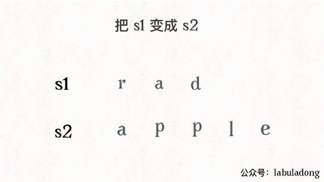
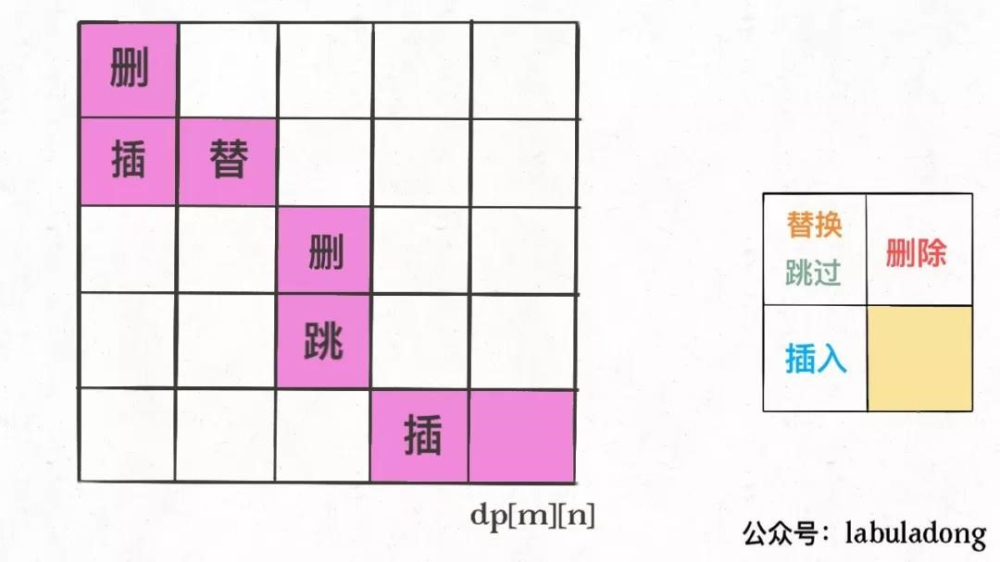

# 动态规划

## **斐波那契数列**

```
int fib(int N) {  
    if (N < 1) return 0;  
    // 备忘录全初始化为 0  
    vector<int> memo(N + 1, 0);  
    // 初始化最简情况  
    return helper(memo, N);  
}  
  
int helper(vector<int>& memo, int n) {  
    // base case   
    if (n == 1 || n == 2) return 1;  
    // 已经计算过  
    if (memo[n] != 0) return memo[n];  
    memo[n] = helper(memo, n - 1) +   
		helper(memo, n - 2);  
    return memo[n];  
}  
```

## **凑零钱问题**

```
def coinChange(coins: List[int], amount: int):  
    # 备忘录  
    memo = dict()  
    def dp(n):  
	# 查备忘录，避免重复计算  
	if n in memo: return memo[n]  
  
	if n == 0: return 0  
	if n < 0: return -1  
	res = float('INF')  
	for coin in coins:  
	    subproblem = dp(n - coin)  
	    if subproblem == -1: continue  
	    res = min(res, 1 + subproblem)  
  
	# 记入备忘录  
	memo[n] = res if res != float('INF') else -1  
	return memo[n]  
  
    return dp(amount) 
```

## **股票买卖**
一次交易由买入和卖出构成，至少需要两天。所以说有效的限制次数 k 应该不超过 n/2，如果超过，就没有约束作用了，相当于 k = +infinity。


第一题是只进行一次交易，相当于 k = 1；

第二题是不限交易次数，相当于 k = +infinity（正无穷）；

第三题是只进行 2 次交易，相当于 k = 2；

剩下两道也是不限交易次数，但是加了交易「冷冻期」和「手续费」的额外条件，其实就是第二题的变种，都很容易处理。


dp[3][2][1] 的含义就是：今天是第三天，我现在手上持有着股票，至今已经进行了 2 次交易。

```
int maxProfit_k_any(int max_k, int[] prices) {
    int n = prices.length;
    if (max_k > n / 2)  
        return maxProfit_k_inf(prices);
    int[][][] dp = new int[n][max_k + 1][2];
    for (int i = 0; i < n; i++)  {
        for (int k = max_k; k >= 1; k--) {
            if (i - 1 == -1) {
                dp[i][k][0] = 0;
                dp[i][k][1] = - prices[i];
                continue;
            }
            dp[i][k][0] = max(dp[i-1][k][0], dp[i-1][k][1] + prices[i]);
            dp[i][k][1] = max(dp[i-1][k][1], dp[i-l][k-1][0] - prices[i]);
        }
    }
    return dp[n - 1] [max_k] [0];
}
```


## **打家劫舍**
198
```
class Solution {
    public int rob(int[] nums) {
        if(nums.length == 1){
            return nums[0];
        } else if(nums.length == 2){
            return Math.max(nums[0],nums[1]);
        }
        int[] dp = new int[nums.length];
        dp[0] = nums[0];
        dp[1] = Math.max(nums[0],nums[1]);
        for (int i = 2; i < nums.length; i++){
            dp[i] = Math.max(dp[i-1],dp[i-2]+nums[i]);
        }
        return dp[nums.length-1];
    }
}
```


## **背包**
### **0-1 背包**
给你一个可装载重量为W的背包和N个物品，每个物品有重量和价值两个属性。其中第i个物品的重量为wt[i]，价值为val[i]，现在让你用这个背包装物品，最多能装的价值是多少？

举个简单的例子，输入如下：

N = 3, W = 4

wt = [2, 1, 3]

val = [4, 2, 3]

算法返回 6，选择前两件物品装进背包，总重量 3 小于W，可以获得最大价值 6。

dp[i][w]的定义如下：对于前i个物品，当前背包的总容量为w，这种情况下可以装的最大价值是dp[i][w]。

```
int knapsack(int W, int N, vector<int>& wt, vector<int>& val) {  
    // vector 全填入 0，base case 已初始化  
    vector<vector<int>> dp(N + 1, vector<int>(W + 1, 0));  
    for (int i = 1; i <= N; i++) {  
	for (int w = 1; w <= W; w++) {  
	    if (w - wt[i-1] < 0) {  
		// 当前背包容量装不下，只能选择不装入背包  
		dp[i][w] = dp[i - 1][w];  
	    } else {  
		// 装入或者不装入背包，择优, i是从 1 开始的，而数组索引是从 0 开始的，所以第i个物品的重量应该是wt [i-1] 
		dp[i][w] = max(dp[i - 1][w - wt[i-1]] + val[i-1],   
			       dp[i - 1][w]);  
	    }  
	}  
    }  
    return dp[N][W];  
}  
```


### **部分背包**
力扣第416：将一个数组分割成两个等和的子集。

假设背包只能装一半，能否刚好装齐

dp[i][j] = x表示，对于前i个物品，当前背包的容量为j时，若x为true，则说明可以恰好将背包装满，若x为false，则说明不能恰好将背包装满。

**base case 为true**：当容量为0时，某种含义表示已被装满，因此为true
```
bool canPartition(vector<int>& nums) {  
    int sum = 0;  
    for (int num : nums) sum += num;  
    // 和为奇数时，不可能划分成两个和相等的集合  
    if (sum % 2 != 0) return false;  
    int n = nums.size();  
    sum = sum / 2;  
    vector<vector<bool>>   
	dp(n + 1, vector<bool>(sum + 1, false));  
    // base case  
    for (int i = 0; i <= n; i++)  
	dp[i][0] = true;  
  
    for (int i = 1; i <= n; i++) {  
	for (int j = 1; j <= sum; j++) {  
	    if (j - nums[i - 1] < 0) {  
	       // 背包容量不足，不能装入第 i 个物品  
		dp[i][j] = dp[i - 1][j];   
	    } else {  
		// 装入或不装入背包  
		dp[i][j] = dp[i - 1][j] | dp[i - 1][j-nums[i-1]];  
	    }  
	}  
    }  
    return dp[n][sum];  
} 
```

状态压缩后：注意到dp[i][j]都是通过上一行dp[i-1][..]转移过来的，也就是说，实际上一直是两行的数据在轮替。

**j要反着遍历**：dp数组其实是起着一个备忘录的作用，解决重叠子问题，

如果正着遍历，某一个dp[j]【A】通过上一行的数据计算过后，之后若有别的dp[j]【B】要通过上一行的A来更新的话，但实际上获得的却是这一行重新更新后的A，与题意不符，

但如果是反着遍历，那么当前行的更新永远都是通过上一行的数据进行的更新。

``` 
bool canPartition(vector<int>& nums) {  
    int sum = 0, n = nums.size();  
    for (int num : nums) sum += num;  
    if (sum % 2 != 0) return false;  
    sum = sum / 2;  
    vector<bool> dp(sum + 1, false);  
    // base case  
    dp[0] = true;  
  
    for (int i = 0; i < n; i++)   
	for (int j = sum; j >= 0; j--)   
	    if (j - nums[i] >= 0)   
		dp[j] = dp[j] || dp[j - nums[i]];  
  
    return dp[sum];  
}  
```


### **完全背包**
LeetCode 第 518 题，凑零钱2

给定不同面额的硬币和一个总金额。写出函数来计算可以凑成总金额的硬币组合数，假设每一种面额的硬币有无限个。


换句话说，有一个背包，最大容量为amount，有一系列物品coins，每个物品的重量为coins[i]，每个物品的数量无限。请问有多少种方法，能够把背包恰好装满？

和之前的两个背包问题，有一个最大的区别就是，**每个物品的数量是无限的**，这也就是传说中的「**完全背包问题**」

**dp[i][j]的定义**如下：

若只使用前i个物品，当背包容量为j时，有dp[i][j]种方法可以装满背包。

换句话说，翻译回我们题目的意思就是：

**若只使用coins中的前i个硬币的面值，若想凑出金额j，有dp[i][j]种凑法**。

经过以上的定义，可以得到：

**base case** 为：

dp[0][..] = 0，如果不使用任何硬币面值，就无法凑出任何金额；

dp[..][0] = 1，如果凑出的目标金额为 0，那么“无为而治”就是唯一的一种凑法。

我们最终想得到的答案就是dp[N][amount]，其中N为coins数组的大小。

```
int change(int amount, int[] coins) {  
    int n = coins.length;  
    int[][] dp = amount int[n + 1][amount + 1];  
    // base case  
    for (int i = 0; i <= n; i++)   
	dp[i][0] = 1;  
  
    for (int i = 1; i <= n; i++) {  
	for (int j = 1; j <= amount; j++)  
	    if (j - coins[i-1] >= 0)  
		dp[i][j] = dp[i - 1][j]   
			 + dp[i][j - coins[i-1]];  
	    else   
		dp[i][j] = dp[i - 1][j];  
    }  
    return dp[n][amount];  
}  
```

状态压缩：

```
int change(int amount, int[] coins) {  
    int n = coins.length;  
    int[] dp = new int[amount + 1];  
    dp[0] = 1; // base case  
    for (int i = 0; i < n; i++)  
	for (int j = 1; j <= amount; j++)  
	    if (j - coins[i] >= 0)  
		dp[j] = dp[j] + dp[j-coins[i]];  
  
    return dp[amount];  
}  
```

## **下降路径最小和**
力扣第 931 题

从第一行matrix[0][..]向下落，落到位置matrix[i][j]的最小路径和为dp(matrix, i, j)。

```
public int minFallingPathSum(int[][] matrix) {  
    int n = matrix.length;  
    int res = Integer.MAX_VALUE;  
    // 备忘录里的值初始化为 66666  
    memo = new int[n][n];  
    for (int i = 0; i < n; i++) {  
	Arrays.fill(memo[i], 66666);  
    }  
    // 终点可能在 matrix[n-1] 的任意一列  
    for (int j = 0; j < n; j++) {  
	res = Math.min(res, dp(matrix, n - 1, j));  
    }  
    return res;  
}  
  
// 备忘录  
int[][] memo;  
  
int dp(int[][] matrix, int i, int j) {  
    // 1、索引合法性检查  
    if (i < 0 || j < 0 ||  
	i >= matrix.length ||  
	j >= matrix[0].length) {  
  
	return 99999;  
    }  
    // 2、base case  
    if (i == 0) {  
	return matrix[0][j];  
    }  
    // 3、查找备忘录，防止重复计算  
    if (memo[i][j] != 66666) {  
	return memo[i][j];  
    }  
    // 进行状态转移  
    memo[i][j] = matrix[i][j] + min(  
	    dp(matrix, i - 1, j),   
	    dp(matrix, i - 1, j - 1),  
	    dp(matrix, i - 1, j + 1)  
	);  
  
    return memo[i][j];  
}  
  
int min(int a, int b, int c) {  
    return Math.min(a, Math.min(b, c));  
}  
```

## **最小编辑距离**
`dp[i-1][j-1]   # 存储 s1[0..i] 和 s2[0..j] 的最小编辑距离`



```
int minDistance(String s1, String s2) {  
    int m = s1.length(), n = s2.length();  
    int[][] dp = new int[m + 1][n + 1];  
    // base case  
    for(int i = 1; i <= m; i++) dp[i][0] = i; //删除s1的i个字符  
    for(int j = 1; j <= n; j++) dp[0][j] = j; //往s1插入j个字符  
    for(int i = 1; i <= m; i++)  
        for(int j = 1; j <= n; j++)  
            if(s1.charAt(i - 1) == s2.charAt(j - 1)) dp[i][j] = dp[i - 1][j - 1];//相等，不做操作  
            else dp[i][j] = Math.min(  
                    dp[i - 1][j] + 1, //删除s1中i对应的字符  
                    dp[i][j - 1] + 1, //往s1插入s2中j对应的字符  
                    dp[i - 1][j - 1] + 1//把s1中i的字符替换为s2中j对应的字符  
                    );  
    //存的整个s1到s2的最小修改距离  
    return dp[m][n];  
}  
int min(int a, int b, int c) {  
    return Math.min(a, Math.min(b, c));  
}  
```

```
// int[][] dp;
Node[][] dp;

class Node {
    int val;
    int choice;
    // 0 代表啥都不做
    // 1 代表插入
    // 2 代表删除
    // 3 代表替换
}

```



## **最大子数组**
以nums[i]为结尾的「最大子数组和」为dp[i]

dp[i]有两种「选择」，

要么与前面的相邻子数组连接，形成一个和更大的子数组；

要么不与前面的子数组连接，自成一派，自己作为一个子数组。

```
int maxSubArray(int[] nums) {  
    int n = nums.length;  
    if (n == 0) return 0;  
    int[] dp = new int[n];  
    // base case  
    // 第一个元素前面没有子数组  
    dp[0] = nums[0];  
    // 状态转移方程  
    for (int i = 1; i < n; i++) {  
	dp[i] = Math.max(nums[i], nums[i] + dp[i - 1]);  
    }  
    // 得到 nums 的最大子数组  
    int res = Integer.MIN_VALUE;  
    for (int i = 0; i < n; i++) {  
	res = Math.max(res, dp[i]);  
    }  
    return res;  
}  
```