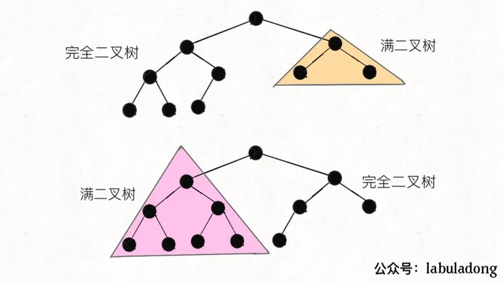

# 树

## **最近公共祖先**
LeetCode 上第 236 题

```
//找结点p或q是否在以root为根的树中
TreeNode lowestCommonAncestor(TreeNode root, TreeNode p, TreeNode q) {
    // base case  
    if (root == null) return null;
    if (root == p || root == q) return root;

    TreeNode left = lowestCommonAncestor(root.left, p, q);
    TreeNode right = lowestCommonAncestor(root.right, p, q);

    // 情况 1,一个结点在左子树,一个结点在右子树(11)
    if (left != null && right != null) {
        return root;
    }
    // 情况 2,不在左子树,也不在右子树(00)
    if (left == null && right == null) {
        return null;
    }
    // 情况 3,在左子树或右子树(10 || 01)
    return left != null ? left : right;
}
```

如果只有一个结点在root为根的树上,只会返回那个结点。

## **翻转二叉树**
力扣第 226 题

```
// 将整棵树的节点翻转  
TreeNode invertTree(TreeNode root) {  
    // base case  
    if (root == null) {  
	return null;  
    }  
  
    /**** 前序遍历位置 ****/  
    // root 节点需要交换它的左右子节点  
    TreeNode tmp = root.left;  
    root.left = root.right;  
    root.right = tmp;  
  
    // 让左右子节点继续翻转它们的子节点  
    invertTree(root.left);  
    invertTree(root.right);  
  
    return root;  
}  
```

## **填充二叉树节点的右侧next指针**
力扣第 116 题

```
// 主函数  
Node connect(Node root) {  
    if (root == null) return null;  
    connectTwoNode(root.left, root.right);  
    return root;  
}  
  
// 定义：输入两个节点，将它俩连接起来  
void connectTwoNode(Node node1, Node node2) {  
    if (node1 == null || node2 == null) {  
	return;  
    }  
    /**** 前序遍历位置 ****/  
    // 将传入的两个节点连接  
    node1.next = node2;  
  
    // 连接相同父节点的两个子节点  
    connectTwoNode(node1.left, node1.right);  
    connectTwoNode(node2.left, node2.right);  
    // 连接跨越父节点的两个子节点  
    connectTwoNode(node1.right, node2.left);  
}
```

## **将二叉树展开为链表**
力扣第 114 题

```
// 定义：将以 root 为根的树拉平为链表  
void flatten(TreeNode root) {  
    // base case  
    if (root == null) return;  
  
    flatten(root.left);  
    flatten(root.right);  
  
    /**** 后序遍历位置 ****/  
    // 1、左右子树已经被拉平成一条链表  
    TreeNode tmpLeft = root.left;  
    TreeNode tmpRight = root.right;  
  
    // 2、将左子树作为右子树  
    root.left = null;  
    root.right = tmpLeft;  
  
    // 3、将原先的右子树接到当前右子树的末端  
    TreeNode p = root;  
    while (p.right != null) {  
	p = p.right;  
    }  
    p.right = tmpRight;  
}  
```

## **构造最大二叉树**
力扣第 654 题

```
/* 将 nums[lo..hi] 构造成符合条件的树，返回根节点 */  
TreeNode build(int[] nums, int lo, int hi) {  
    // base case  
    if (lo > hi) {  
	return null;  
    }  
  
    // 找到数组中的最大值和对应的索引  
    int index = -1, maxVal = Integer.MIN_VALUE;  
    for (int i = lo; i <= hi; i++) {  
	if (maxVal < nums[i]) {  
	    index = i;  
	    maxVal = nums[i];  
	}  
    }  
  
    TreeNode root = new TreeNode(maxVal);  
    // 递归调用构造左右子树  
    root.left = build(nums, lo, index - 1);  
    root.right = build(nums, index + 1, hi);  
  
    return root;  
}  
```

## **中序和先序构造二叉树**
```
TreeNode build(int[] preorder, int preStart, int preEnd,   
	       int[] inorder, int inStart, int inEnd) {  
  
    if (preStart > preEnd) {  
	return null;  
    }  
  
    // root 节点对应的值就是前序遍历数组的第一个元素  
    int rootVal = preorder[preStart];  
    // rootVal 在中序遍历数组中的索引  
    int index = 0;  
    for (int i = inStart; i <= inEnd; i++) {  
	if (inorder[i] == rootVal) {  
	    index = i;  
	    break;  
	}  
    }  
  
    int leftSize = index - inStart;  
  
    // 先构造出当前根节点  
    TreeNode root = new TreeNode(rootVal);  
    // 递归构造左右子树  
    root.left = build(preorder, preStart + 1, preStart + leftSize,  
		      inorder, inStart, index - 1);  
  
    root.right = build(preorder, preStart + leftSize + 1, preEnd,  
		       inorder, index + 1, inEnd);  
    return root;  
}  
```


## **寻找重复子树**
主要是要通过“后序”的方式把一棵树描述下来。才好用字符串对比。

```
// 记录所有子树以及出现的次数  
HashMap<String, Integer> memo = new HashMap<>();  
// 记录重复的子树根节点  
LinkedList<TreeNode> res = new LinkedList<>();  
  
/* 主函数 */  
List<TreeNode> findDuplicateSubtrees(TreeNode root) {  
    traverse(root);  
    return res;  
}  
  
/* 辅助函数 */  
String traverse(TreeNode root) {  
    if (root == null) {  
	return "#";  
    }  
  
    String left = traverse(root.left);  
    String right = traverse(root.right);  
  
    String subTree = left + "," + right+ "," + root.val;  
  
    int freq = memo.getOrDefault(subTree, 0);  
    // 多次重复也只会被加入结果集一次  
    if (freq == 1) {  
	res.add(root);  
    }  
    // 给子树对应的出现次数加一  
    memo.put(subTree, freq + 1);  
    return subTree;  
}  
```

## **二叉搜索树中第K小的元素**
力扣第 230 题

```
int kthSmallest(TreeNode root, int k) {  
    // 利用 BST 的中序遍历特性  
    traverse(root, k);  
    return res;  
}  
  
// 记录结果  
int res = 0;  
// 记录当前元素的排名  
int rank = 0;  
void traverse(TreeNode root, int k) {  
    if (root == null) {  
	return;  
    }  
    traverse(root.left, k);  
    /* 中序遍历代码位置 */  
    rank++;  
    if (k == rank) {  
	// 找到第 k 小的元素  
	res = root.val;  
	return;  
    }  
    /*****************/  
    traverse(root.right, k);  
}  
```

## **BST 转化累加树**
力扣第 538 题和 1038 题

```
// 记录累加和  
int sum = 0;  
void traverse(TreeNode root) {  
    if (root == null) {  
	return;  
    }  
    traverse(root.right);  
    // 维护累加和  
    sum += root.val;  
    // 将 BST 转化成累加树  
    root.val = sum;  
    traverse(root.left);  
}  
```

## **验证bst的合法性**

```
public boolean isValidBST(TreeNode root) {  
    return isValid(root, null, null);  
}  
    //左子树中最大的值 < node.val < 右边的最小值  
public boolean isValid(TreeNode node, TreeNode max, TreeNode min) {  
    if(node == null) return true;  
    if(max != null && node.val <= max.val) return false;  
    if(min != null && node.val >= min.val) return false;  
    return isValid(node.left, max, node) && isValid(node.right, node, min);  
}  
```

## **bst 中插入一个数**

```
TreeNode insertIntoBST(TreeNode root, int val) {  
    // 找到空位置插入新节点  
    if (root == null) return new TreeNode(val);  
    // if (root.val == val)  
    //     BST 中一般不会插入已存在元素  
    if (root.val < val)   
	root.right = insertIntoBST(root.right, val);  
    if (root.val > val)   
	root.left = insertIntoBST(root.left, val);  
    return root;  
}  
```
 
## **bst删除一个数**
情况 3：A有两个子节点，麻烦了，为了不破坏 BST 的性质，A必须找到左子树中最大的那个节点，或者右子树中最小的那个节点来接替自己。我们以第二种方式讲解。

```
TreeNode deleteNode(TreeNode root, int key) {  
    if (root == null) return null;  
    if (root.val == key) {  
	// 这两个 if 把情况 1 和 2 都正确处理了  
	if (root.left == null) return root.right;  
	if (root.right == null) return root.left;  
	// 处理情况 3,找右子树中最小的那个节点来接替自己  
	TreeNode minNode = getMin(root.right);  
	root.val = minNode.val;  
	root.right = deleteNode(root.right, minNode.val);  
    } else if (root.val > key) {  
	root.left = deleteNode(root.left, key);  
    } else if (root.val < key) {  
	root.right = deleteNode(root.right, key);  
    }  
    return root;  
}  
  
TreeNode getMin(TreeNode node) {  
    // BST 最左边的就是最小的  
    while (node.left != null) node = node.left;  
    return node;  
} 
```

## **不同的二叉搜索树1**
力扣第 96 题，只用计算数量。


n=5时，以3为根能构造成的个数


```
// 备忘录  
int[][] memo;  
  
int numTrees(int n) {  
    // 备忘录的值初始化为 0  
    memo = new int[n + 1][n + 1];  
    return count(1, n);  
}  
  
int count(int lo, int hi) {  
    if (lo > hi) return 1;  
    // 查备忘录  
    if (memo[lo][hi] != 0) {  
	return memo[lo][hi];  
    }  
  
    int res = 0;  
    for (int mid = lo; mid <= hi; mid++) {  
	int left = count(lo, mid - 1);  
	int right = count(mid + 1, hi);  
	res += left * right;  
    }  
    // 将结果存入备忘录  
    memo[lo][hi] = res;  
  
    return res;  
}  
```

## **不同的二叉搜索树2**
力扣第 95 题，返回构成的不同的树的列表

```
/* 主函数 */  
public List<TreeNode> generateTrees(int n) {  
    if (n == 0) return new LinkedList<>();  
    // 构造闭区间 [1, n] 组成的 BST   
    return build(1, n);  
}  
  
/* 构造闭区间 [lo, hi] 组成的 BST */  
List<TreeNode> build(int lo, int hi) {  
    List<TreeNode> res = new LinkedList<>();  
    // base case  
    if (lo > hi) {  
	res.add(null);  
	return res;  
    }  
  
    // 1、穷举 root 节点的所有可能。  
    for (int i = lo; i <= hi; i++) {  
	// 2、递归构造出左右子树的所有合法 BST。  
	List<TreeNode> leftTree = build(lo, i - 1);  
	List<TreeNode> rightTree = build(i + 1, hi);  
	// 3、给 root 节点穷举所有左右子树的组合。  
	for (TreeNode left : leftTree) {  
	    for (TreeNode right : rightTree) {  
		// i 作为根节点 root 的值  
		TreeNode root = new TreeNode(i);  
		root.left = left;  
		root.right = right;  
		res.add(root);  
	    }  
	}  
    }  
  
    return res;  
}  
```

## **二叉搜索子树的最大键值和**
力扣第 1373 题

算法返回20

任何一个单独的节点肯定是 BST，也就是说，再不济，二叉树最下面的叶子节点肯定是 BST。

traverse(root)返回一个大小为 4 的 int 数组，我们暂且称它为res，其中：

- res[0]记录以root为根的二叉树是否是 BST，若为 1 则说明是 BST，若为 0 则说明不是 BST；

- res[1]记录以root为根的二叉树所有节点中的最小值；

- res[2]记录以root为根的二叉树所有节点中的最大值；

- res[3]记录以root为根的二叉树所有节点值之和。

```
int[] traverse(TreeNode root) {  
    // base case  
    if (root == null) {  
	return new int[] {  
	    1, Integer.MAX_VALUE, Integer.MIN_VALUE, 0  
	};  
    }  
  
    // 递归计算左右子树  
    int[] left = traverse(root.left);  
    int[] right = traverse(root.right);  
  
    /******* 后序遍历位置 *******/  
    int[] res = new int[4];  
    // 这个 if 在判断以 root 为根的二叉树是不是 BST  
    if (left[0] == 1 && right[0] == 1 &&  
	root.val > left[2] && root.val < right[1]) {  
	// 以 root 为根的二叉树是 BST  
	res[0] = 1;  
	// 计算以 root 为根的这棵 BST 的最小值，考虑base case,需要比较  
	res[1] = Math.min(left[1], root.val);  
	// 计算以 root 为根的这棵 BST 的最大值，考虑base case,需要比较
	res[2] = Math.max(right[2], root.val);  
	// 计算以 root 为根的这棵 BST 所有节点之和  
	res[3] = left[3] + right[3] + root.val;  
	// 更新全局变量  
	maxSum = Math.max(maxSum, res[3]);  
    } else {  
	// 以 root 为根的二叉树不是 BST  
	res[0] = 0;  
	// 其他的值都没必要计算了，因为用不到  
    }  
    /**************************/  
  
    return res;  
}  
```


## **二叉树的序列化与反序列化**
中序遍历无法反序列化

```
String Serialize(TreeNode root) {
    //遇到null怎么办
    if(root==null){
        return "X,";
    }
    String left=Serialize(root.left);
    String right=Serialize(root.right);
    return root.val+","+left+right;
        
}
TreeNode Deserialize(String str) {
    String[] nodes=str.split(",");
    //将String数组转换为list
    Deque<String> deque=new LinkedList<>(Arrays.asList(nodes));
    return buildTree(deque);
}
TreeNode buildTree(Deque<String> dq){
    String var=dq.poll();
    //若为X，说明为空节点
    if(var.equals("X")){
        return null;
    }
    TreeNode root=new TreeNode(Integer.parseInt(var));
    root.left=buildTree(dq);
    root.right=buildTree(dq);
    return root;
}
```

## **扁平化嵌套列表迭代器**
LeetCode 第 341 题

```
public class NestedInteger {  
    private Integer val;  
    private List<NestedInteger> list;  
  
    public NestedInteger(Integer val) {  
	this.val = val;  
	this.list = null;  
    }  
    public NestedInteger(List<NestedInteger> list) {  
	this.list = list;  
	this.val = null;  
    }  
  
    // 如果其中存的是一个整数，则返回 true，否则返回 false  
    public boolean isInteger() {  
	return val != null;  
    }  
  
    // 如果其中存的是一个整数，则返回这个整数，否则返回 null  
    public Integer getInteger() {  
	return this.val;  
    }  
  
    // 如果其中存的是一个列表，则返回这个列表，否则返回 null  
    public List<NestedInteger> getList() {  
	return this.list;  
    }  
}  
public class NestedIterator implements Iterator<Integer> {  
    private LinkedList<NestedInteger> list;  
  
    public NestedIterator(List<NestedInteger> nestedList) {  
	// 不直接用 nestedList 的引用，是因为不能确定它的底层实现  
	// 必须保证是 LinkedList，否则下面的 addFirst 会很低效  
	list = new LinkedList<>(nestedList);  
    }  
  
    public Integer next() {  
	// hasNext 方法保证了第一个元素一定是整数类型  
	return list.remove(0).getInteger();  
    }  
  
    public boolean hasNext() {  
	// 循环拆分列表元素，直到列表第一个元素是整数类型  
	while (!list.isEmpty() && !list.get(0).isInteger()) {  
	    // 当列表开头第一个元素是列表类型时，进入循环  
	    List<NestedInteger> first = list.remove(0).getList();  
	    // 将第一个列表打平并按顺序添加到开头  
	    for (int i = first.size() - 1; i >= 0; i--) {  
		list.addFirst(first.get(i));  
	    }  
	}  
	return !list.isEmpty();  
    }  
}  
```

## **完全二叉树的结点个数**
关键点在于，这两个递归只有一个会真的递归下去，另一个一定会触发hl == hr而立即返回，不会递归下去。

一棵完全二叉树的两棵子树，至少有一棵是满二叉树：



```
public int countNodes(TreeNode root) {  
    TreeNode l = root, r = root;  
    // 记录左、右子树的高度  
    int hl = 0, hr = 0;  
    while (l != null) {  
	l = l.left;  
	hl++;  
    }  
    while (r != null) {  
	r = r.right;  
	hr++;  
    }  
    // 如果左右子树的高度相同，则是一棵满二叉树  
    if (hl == hr) {  
	return (int)Math.pow(2, hl) - 1;  
    }  
    // 如果左右高度不同，则按照普通二叉树的逻辑计算  
    return 1 + countNodes(root.left) + countNodes(root.right);  
}  
```