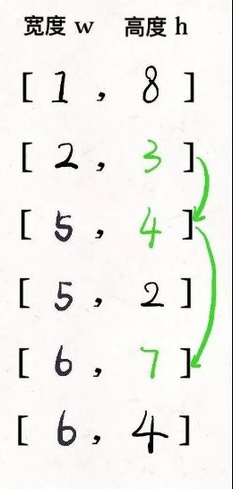
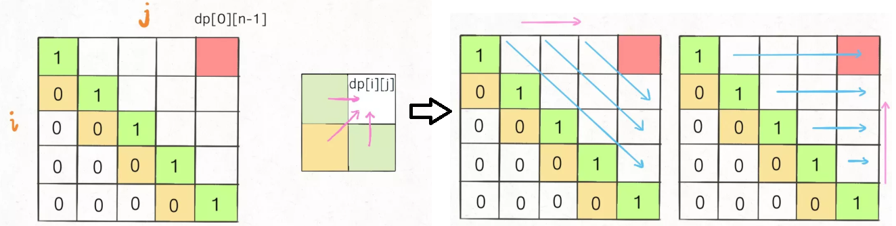
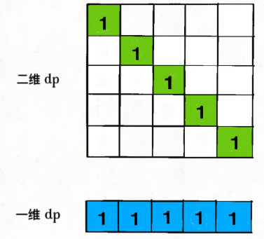

# 子序列（动态规划）

## **最长递增子序列**
①动态规划：在子数组array[0..i]中，以array[i]结尾的目标子序列（最长递增子序列）的长度是dp[i]。

```
public int lengthofLIS(int[] nums) {
    int[] dp = new int[nums.length];
    // base case 全部初始化为1  
    Arrays.fill(dp, 1);
    for (int i = 0; i < nums.length; i++) {
        for (int j = 0; j < i; j++) {
            if(nums[j] < nums[i]) dp[i] = Math.max(dp[i], dp[j] + 1);
        }
    }
    int res = 0;
    for (int i = 0; i < dp.length; i++) {
        res = Math.max(res, dp[i]);
    }
    return res;
}
```

②扑克牌游戏解释了二分查找解法
## **信封嵌套**


```
// envelopes = [[w, h], [w, h]...]  
public int maxEnvelopes(int[][] envelopes) {  
    int n = envelopes.length;  
    //按宽度升序排列，如果宽度一样，则按高度降序排列   
    Arrays.sort(envelopes, new Comparator<int[]>(){  
	public int compare(int[] a, int[] b) {  
	    return a[0] == b[0] ? b[1] - a[1] : a[0] - b[0];  
	}  
    })；  
    //对高度数组寻找LIS  
    int[] height = new int[n];  
    for (int i = 0; i < n; i++)  
	height[i] = envelopes[i][1];  
    return lengthOfLIS(height);  
}  
```

## **最长公共子序列**（长度）
在子数组arr1[0..i]和子数组arr2[0..j]中，我们要求的子序列（最长公共子序列）长度为dp[i][j]。

dp[0][..]和dp[..][0]都应该初始化为 0，这就是 base case。

```
int[][] longestCommonSubsequence(String str1, String str2) {
    int m = str1.length(), n = str2.length();
    //DP table base case  
    int[][] dp = new int[m + 1][n + 1];
    for (int i = 1; i < m + 1; i++)  
        for (int j = 1; j < n + 1; j++)  
            if(str1.charAt(i - 1) == str2.charAt(j - 1))   
            	dp[i][j] = dp[i - 1][j - 1] + 1; 
            else   
              dp[i][j] = Math.max(dp[i - 1][j], dp[i][j - 1]);
    return dp[m][n];
}
```

## **最长回文子序列**
在子数组array[i..j]中，我们要求的子序列（最长回文子序列）的长度为dp[i][j]。

base case，如果只有一个字符，显然最长回文子序列长度是 1，也就是dp[i][j] = 1,(i == j)



为了保证每次计算dp[i][j]，左、下、左下三个方向的位置已经被计算出来，只能**斜着遍历**或者**反着遍历**：

【斜着遍历】:
```
// 斜着遍历数组  
// 第一行的第几列
for (int k = 2; k <= n; k++) {
    // 遍历行
    for (int i = 0; i <= n - k; i++) {
        // 第一行的列加上当前所在行
        int j = k + i - 1;
        // 计算 dp[i][j]
    }
}
```


【反着遍历】：

```
int longestPalindromeSubseq(string s) {
    int n = s.size();
    // dp 数组全部初始化为 0  
    vector<vector<int>> dp(n, vector<int>(n, 0));
    // base case  
    for (int i = 0; i < n; i++)  
        dp[i][i] = 1;
    // 反着遍历保证正确的状态转移  
    for (int i = n - 1; i >= 0; i--) {
        for (int j = i + 1; j < n; j++) {
            // 状态转移方程  
            if (s[i] == s[j])  
                dp[i][j] = dp[i + 1][j - 1] + 2; 
            else  
                dp[i][j] = max(dp[i + 1][j], dp[i][j - 1]);
        }
    }
    // 整个 s 的最长回文子串长度  
    return dp[0][n - 1];
}
```

状态压缩：

base case: 投影



状态转移：从二维到一维

dp[j]赋新值之前：

- dp[j]的值就是外层 for 循环上一次迭代算出来的值，也就是对应二维dp数组中dp[i+1][j]的位置。

- dp[j-1]的值就是内层 for 循环上一次迭代算出来的值，也就是对应二维dp数组中dp[i][j-1]的位置。

- 只要保存dp[j]的值即dp[i+1][j]，到下一轮内层循环时，即j++了，不就变成dp[i+1][j+1]了。

```
int longestPalindromeSubseq(string s) {
    int n = s.size();
    // base case：一维 dp 数组全部初始化为 1  
    vector<int> dp(n, 1);
    for (int i = n - 2; i >= 0; i--) {
        int pre = 0;
        for (int j = i + 1; j < n; j++) {
            int temp = dp[j];
            // 状态转移方程  
            if (s[i] == s[j])  
                // dp[i][j] = dp[i+1][j-1] + 2;  
                dp[j] = pre + 2; 
            else  
                // dp[i][j] = max(dp[i+1][j], dp[i][j-1]);  
                dp[j] = max(dp[j], dp[j - 1]);
            pre = temp;
        }
    }
    return dp[n - 1];
}
```
