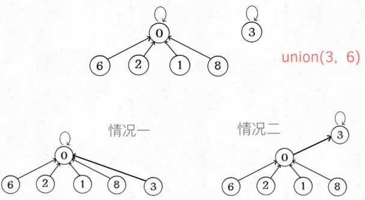
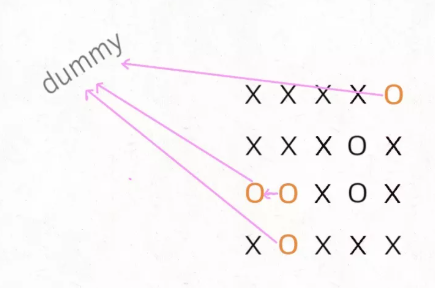
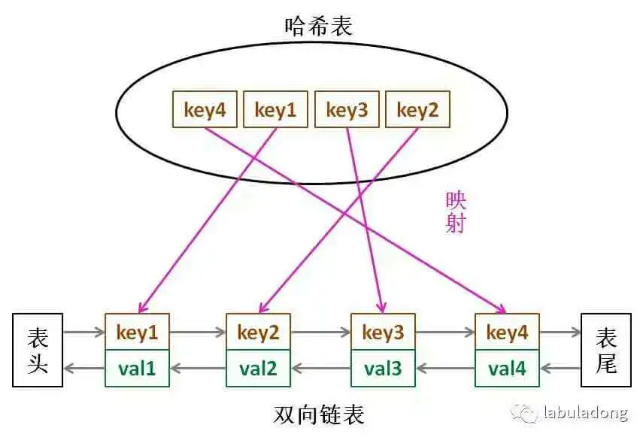
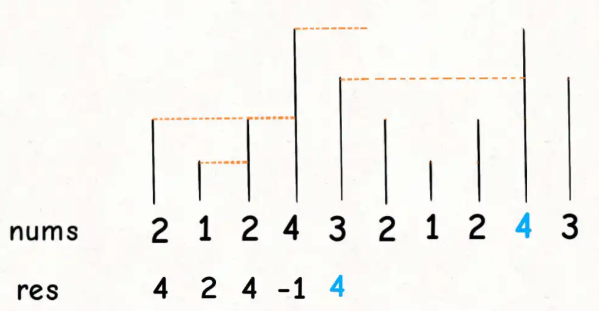
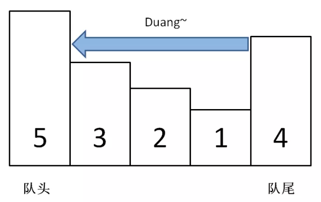

# 数据结构
## **Union-Find（并查集算法）**
解决图论中「**动态连通性**」问题的
动态连通性：给一幅图中的结点连线
「连通」是一种等价关系，也就是说具有如下三个性质：
1、自反性：节点p和p是连通的。
2、对称性：如果节点p和q连通，那么q和p也连通。
3、传递性：如果节点p和q连通，q和r连通，那么p和r也连通。
连通后的结点形成的组合称为一个连通分量，通过“自反性”知：独立的，出入度皆为0的一个结点也是一个连通分量。
使用森林（若干棵树）来表示图的动态连通性，用**数组**来具体**实现**这个【**森林**】。
应用场景：
1. 编译器判断同一个变量的不同引用，
1. 社交网络中的朋友圈计算等等。
```
class UF {
    // 连通分量个数  
    private int count;
    // 存储一棵树  
    private int[] parent;
    // 记录树的“重量”  
    private int[] size;
    public UF(int n) {
        this.count = n;
        parent = new int[n];
        size = new int[n];
        for (int i = 0; i < n; i++) {
            parent[i] = i;
            size[i] = 1;
        }
    }
    public void union(int p, int q) {
        int rootP = find(p);
        int rootQ = find(q);
        if (rootP == rootQ)  
                return;
        // 小树接到大树下面，较平衡  关键点1
        if (size[rootP] > size[rootQ]) {
            parent[rootQ] = rootP;
            size[rootP] += size[rootQ];
        } else {
            parent[rootP] = rootQ;
            size[rootQ] += size[rootP];
        }
        count--;
    }
    /* 判断 p 和 q 是否互相连通 */
    public Boolean connected(int p, int q) {
        int rootP = find(p);
        int rootQ = find(q);
        // 处于同一棵树上的节点，相互连通  
        return rootP == rootQ;
    }
    private int find(int x) {
        while (parent[x] != x) {
            // 进行路径压缩，每次调用都会提高找到parent的速度，并且改变parent的指向  关键点2保证了树高为常数（不超过 3）
            parent[x] = parent[parent[x]];
            x = parent[x];
        }
        return x;
    }
}
```

如果带有重量平衡优化，一定会得到情况一，
而去掉重量优化，可能出现情况二。而此时高度为3，会触发路径压缩那个while循环，会多执行很多次路径压缩，将第三层节点压缩到第二层。
而情况一根本不会触发路径压缩， 也就是说，去掉重量平衡，虽然对于单个的find函数调用，时间复杂度依然是 O(1)，但是对于 API 调用的整个过程，效率会有一定的下降。
### **删去被包围的O**
力扣第 130 题
将矩阵中完全被X围住的O替换成X，
边角上的O一定不会被围，进一步，与边角上的O相连的O也不会被X围四面，也不会被替换
传统解法：
①先用 for 循环遍历棋盘的四边，用 DFS 算法把那些与边界相连的O换成一个特殊字符，比如#

②然后再遍历整个棋盘，把剩下的O换成X，把#恢复成O

二维坐标映射到一维的常用技巧：索引从0开始： (x,y) à x*n+y 【m行n列】
使用union-find:

```
void solve(char[][] board) {
    if (board.length == 0) return;
    int m = board.length;
    int n = board[0].length;
    // 给 dummy 留一个额外位置  
    UF uf = new UF(m * n + 1);
    int dummy = m * n;
    // 将首列和末列的 O 与 dummy 连通  
    for (int i = 0; i < m; i++) {
        if (board[i][0] == 'O')  
                uf.union(i * n, dummy);
        if (board[i][n - 1] == 'O')  
                uf.union(i * n + n - 1, dummy);
    }
    // 将首行和末行的 O 与 dummy 连通  
    for (int j = 0; j < n; j++) {
        if (board[0][j] == 'O')  
                uf.union(j, dummy);
        if (board[m - 1][j] == 'O')  
                uf.union(n * (m - 1) + j, dummy);
    }
    // 方向数组 d 是上下左右搜索的常用手法  
    int[][] d = new int[][]{ {1,0}, {0,1}, {0,-1}, {-1,0} };
    for (int i = 1; i < m - 1; i++)   
        for (int j = 1; j < n - 1; j++)   
            if (board[i][j] == 'O')  
            // 将此 O 与上下左右的 O 连通  
    for (int k = 0; k < 4; k++) {
        int x = i + d[k][0];
        int y = j + d[k][1];
        if (board[x][y] == 'O')  
                    uf.union(x * n + y, i * n + j);
    }
    // 以上是将所有与边界相连的O都连在一棵dummy树上  
    // 如果不和 dummy 连通的 O，都要被替换  
    for (int i = 1; i < m - 1; i++)   
        for (int j = 1; j < n - 1; j++)   
            if (!uf.connected(dummy, i * n + j))  
            board[i][j] = 'X';
}
```
### **判定合法算式**
```
Boolean equationsPossible(String[] equations) {
    // 26 个英文字母  
    UF uf = new UF(26);
    // 先让相等的字母形成连通分量  
    for (String eq : equations) {
        if (eq.charAt(1) == '=') {
            char x = eq.charAt(0);
            char y = eq.charAt(3);
            uf.union(x - 'a', y - 'a');
        }
    }
    // 检查不等关系是否打破相等关系的连通性  
    for (String eq : equations) {
        if (eq.charAt(1) == '!') {
            char x = eq.charAt(0);
            char y = eq.charAt(3);
            // 如果相等关系成立，就是逻辑冲突  
            if (uf.connected(x - 'a', y - 'a'))  
                    return false;
        }
    }
    return true;
}
```
## **LRU**
力扣第 146 题
需要数据结构：LinkedHashMap【put时，是插入尾部】

```
class LRUCache {
    int cap;
    LinkedHashMap<Integer, Integer> linkedHashMap = new LinkedHashMap<>();
    public LRUCache(int capacity) {
        this.cap = capacity;
    }
    public int get(int key) {
        if (!linkedHashMap.containsKey(key)) {
            return -1;
        }
        // 将 key 变为最近使用  
        makeRecently(key);
        return linkedHashMap.get(key);
    }
    public void put(int key, int val) {
        if (linkedHashMap.containsKey(key)) {
            // 修改 key 的值，插入的是双向链表的尾部  
            linkedHashMap.put(key, val);
            // 将 key 变为最近使用  
            makeRecently(key);
            return;
        }
        if (linkedHashMap.size() >= this.cap) {
            // 链表头部就是最久未使用的 key  
            int oldestKey = linkedHashMap.keySet().iterator().next();
            linkedHashMap.remove(oldestKey);
        }
        // 将新的 key 添加链表尾部  
        linkedHashMap.put(key, val);
    }
    private void makeRecently(int key) {
        int val = linkedHashMap.get(key);
        // 删除 key，重新插入到队尾  
        linkedHashMap.remove(key);
        linkedHashMap.put(key, val);
    }
}
```
## **LFU**
淘汰访问频次最低的数据，如果访问频次最低的数据有多条，需要淘汰最旧的数据。
```
class LFUCache {
    // key 到 val 的映射，我们后文称为 KV 表  
    HashMap<Integer, Integer> keyToVal;
    // key 到 freq 的映射，我们后文称为 KF 表  
    HashMap<Integer, Integer> keyToFreq;
    // freq 到 key 列表的映射，我们后文称为 FK 表，freq对key是一对多的关系  
    HashMap<Integer, LinkedHashSet<Integer>> freqToKeys;
    // 记录最小的频次，避免遍历一遍去找  
    int minFreq;
    // 记录 LFU 缓存的最大容量  
    int cap;
    public LFUCache(int capacity) {
        keyToVal = new HashMap<>();
        keyToFreq = new HashMap<>();
        freqToKeys = new HashMap<>();
        this.cap = capacity;
        this.minFreq = 0;
    }
    public int get(int key) {
        if (!keyToVal.containsKey(key)) {
            return -1;
        }
        // 增加 key 对应的 freq  
        increaseFreq(key);
        return keyToVal.get(key);
    }
    public void put(int key, int val) {
        if (this.cap <= 0) return;
        /* 若 key 已存在，修改对应的 val 即可 */
        if (keyToVal.containsKey(key)) {
            keyToVal.put(key, val);
            // key 对应的 freq 加一  
            increaseFreq(key);
            return;
        }
        /* key 不存在，需要插入 */
        /* 容量已满的话需要淘汰一个 freq 最小的 key */
        if (this.cap <= keyToVal.size()) {
            removeMinFreqKey();
        }
        /* 插入 key 和 val，对应的 freq 为 1 */
        // 插入 KV 表  
        keyToVal.put(key, val);
        // 插入 KF 表  
        keyToFreq.put(key, 1);
        // 插入 FK 表  
        freqToKeys.putIfAbsent(1, new LinkedHashSet<>());
        freqToKeys.get(1).add(key);
        // 插入新 key 后最小的 freq 肯定是 1  
        this.minFreq = 1;
    }
    private void increaseFreq(int key) {
        int freq = keyToFreq.get(key);
        /* 更新 KF 表 */
        keyToFreq.put(key, freq + 1);
        /* 更新 FK 表 */
        // 将 key 从 freq 对应的列表中删除  
        freqToKeys.get(freq).remove(key);
        // 将 key 加入 freq + 1 对应的列表中  
        freqToKeys.putIfAbsent(freq + 1, new LinkedHashSet<>());
        freqToKeys.get(freq + 1).add(key);
        // 如果 freq 对应的列表空了，移除这个 freq  
        if (freqToKeys.get(freq).isEmpty()) {
            freqToKeys.remove(freq);
            // 如果这个 freq 恰好是 minFreq，更新 minFreq  
            if (freq == this.minFreq) {
                this.minFreq++;
            }
        }
    }
    private void removeMinFreqKey() {
        // freq 最小的 key 列表  
        LinkedHashSet<Integer> keyList = freqToKeys.get(this.minFreq);
        // 其中最先被插入的那个 key 即最旧的key，就是该被淘汰的 key  
        int deletedKey = keyList.iterator().next();
        /* 更新 FK 表 */
        keyList.remove(deletedKey);
        if (keyList.isEmpty()) {
            freqToKeys.remove(this.minFreq);
            // 问：这里需要更新 minFreq 的值吗？
        }
        /* 更新 KV 表 */
        keyToVal.remove(deletedKey);
        /* 更新 KF 表 */
        keyToFreq.remove(deletedKey);
    }
}
```
## **最大频率栈**
力扣第 895 题
```
class FreqStack {
    // 记录 FreqStack 中元素的最大频率  
    int maxFreq = 0;
    // 记录 FreqStack 中每个 val 对应的出现频率，后文就称为 VF 表  
    HashMap<Integer, Integer> valToFreq = new HashMap<>();
    // 记录频率 freq 对应的 val 列表，后文就称为 FV 表  
    HashMap<Integer, Stack<Integer>> freqToVals = new HashMap<>();
    // 在栈中加入一个元素 val  
    public void push(int val) {
        // 修改 VF 表：val 对应的 freq 加一  
        int freq = valToFreq.getOrDefault(val, 0) + 1;
        valToFreq.put(val, freq);
        // 修改 FV 表：在 freq 对应的列表加上 val  
        freqToVals.putIfAbsent(freq, new Stack<>());
        freqToVals.get(freq).push(val);
        // 更新 maxFreq  
        maxFreq = Math.max(maxFreq, freq);
    }
    // 从栈中删除并返回出现频率最高的元素  
    // 如果频率最高的元素不止一个，  
    // 则返回最近添加的那个元素  
    public int pop() {
        // 修改 FV 表：pop 出一个 maxFreq 对应的元素 v  
        Stack<Integer> vals = freqToVals.get(maxFreq);
        int v = vals.pop();
        // 修改 VF 表：v 对应的 freq 减一  
        int freq = valToFreq.get(v) - 1;
        valToFreq.put(v, freq);
        // 更新 maxFreq  
        if (vals.isEmpty()) {
            // 如果 maxFreq 对应的元素空了  
            maxFreq--;
        }
        return v;
    }
}
```
## **数据流的中位数**
力扣第 295 题
维护：
```
class ../medianFinder {
    private PriorityQueue<Integer> large;
    private PriorityQueue<Integer> small;
    public ../medianFinder() {
        // 小顶堆，存的是较大的数据  
        large = new PriorityQueue<>();
        // 大顶堆，存的是较小的数据，使用的是Comparator将其变为大根堆  
        small = new PriorityQueue<>((a, b) -> {
            return b - a;
        }
        );
    }
    public double find../median() {
        // 如果元素不一样多，多的那个堆的堆顶元素就是中位数  
        if (large.size() < small.size()) {
            return small.peek();
        } else if (large.size() > small.size()) {
            return large.peek();
        }
        // 如果元素一样多，两个堆堆顶元素的平均数是中位数  
        return (large.peek() + small.peek()) / 2.0;
    }
    public void addNum(int num) {
        if (small.size() >= large.size()) {
            small.offer(num);
            large.offer(small.poll());
        } else {
            large.offer(num);
            small.offer(large.poll());
        }
    }
}
```
添加元素，假设向large中插入元素：
如果插入的num小于small的堆顶元素，那么num就会留在small堆里，为了保证两个堆的元素数量之差不大于 1，作为交换，把small堆顶部的元素再插到large堆里。
如果插入的num大于small的堆顶元素，那么num就会成为samll的堆顶元素，最后还是会被插入large堆中。
反之，向small中插入元素是一个道理，
## **朋友圈时间线**
LeetCode 上第 335 道题
刚加到女神的微信，然后我去刷新一下我的朋友圈动态，那么女神的动态就会出现在我的动态列表，而且会和其他动态按时间排好序。
就是搞个大根堆，然后合并k个有序链表。
```
public List<Integer> getNewsFeed(int userId) {
    List<Integer> res = new ArrayList<>();
    if (!userMap.containsKey(userId)) return res;
    // 关注列表的⽤户 Id
    Set<Integer> users = userMap.get(userId).followed;
    // ⾃动通过 time 属性从⼤到⼩排序，容量为 users 的⼤⼩
    PriorityQueue<Tweet> pq =
        new PriorityQueue<>(users.size(), (a, b)->(b.time - a.time));
    // 先将所有链表头节点插⼊优先级队列
    for (int id : users) {
        Tweet twt = userMap.get(id).head;
        if (twt == null) continue;
        pq.add(twt);
    }
    while (!pq.isEmpty()) {
        // 最多返回 10 条就够了
        if (res.size() == 10) break;
        // 弹出 time 值最⼤的（最近发表的）
        Tweet twt = pq.poll();
        res.add(twt.id);
        // 将下⼀篇 Tweet 插⼊进⾏排序
        if (twt.next != null)
                pq.add(twt.next);
    }
    return res;
}
```
## **单调栈**
### **下一个更大元素 I**
力扣第 496 题：从后面找比当前索引指向的元素更大的元素

O(n)：总共有n个元素，每个元素都被push入栈了一次，而最多会被pop一次，没有任何冗余操作。所以总的计算规模是和元素规模n成正比的。
```
vector<int> nextGreaterElement(vector<int>& nums) {
    vector<int> res(nums.size());
    // 存放答案的数组  
    stack<int> s;
    // 倒着往栈里放  
    for (int i = nums.size() - 1; i >= 0; i--) {
        // 判定个子高矮  
        while (!s.empty() && s.top() <= nums[i]) {
            // 矮个起开，反正也被挡着了。。。  
            s.pop();
        }
        // nums[i] 身后的 next great number  
        res[i] = s.empty() ? -1 : s.top();
        //   
        s.push(nums[i]);
    }
    return res;
}
```
### **更暖和的气温**
力扣第 1118 题：从后面找比当前索引指向的元素更大的元素
```
vector<int> dailyTemperatures(vector<int>& T) {
    vector<int> res(T.size());
    // 这里放元素索引，而不是元素  
    stack<int> s;
    /* 单调栈模板 */
    for (int i = T.size() - 1; i >= 0; i--) {
        while (!s.empty() && T[s.top()] <= T[i]) {
            s.pop();
        }
        // 得到索引间距  
        res[i] = s.empty() ? 0 : (s.top() - i);
        // 将索引入栈，而不是元素  
        s.push(i);
    }
    return res;
}
```
### **下一个更大元素 II**
如果是循环数组，常用套路就是将数组长度翻倍：

``` 
vector<int> nextGreaterElements(vector<int>& nums) {
    int n = nums.size();
    vector<int> res(n);
    stack<int> s;
    // 假装这个数组长度翻倍了  
    for (int i = 2 * n - 1; i >= 0; i--) {
        // 索引要求模，其他的和模板一样  
        while (!s.empty() && s.top() <= nums[i % n])  
                s.pop();
        res[i % n] = s.empty() ? -1 : s.top();
        s.push(nums[i % n]);
    }
    return res;
}
```
## **单调队列**
### **滑动窗口最大值**
力扣第 239 题
push操作中含有 while 循环，复杂度确实不是O(1)，但是算法整体的复杂度依然是O(N)线性时间。要这样想，nums中的每个元素最多被push_back和pop_back一次，没有任何多余操作，所以整体的复杂度还是O(N)

```
/* 单调队列的实现 */
class MonotonicQueue {
    LinkedList<Integer> q = new LinkedList<>();
    public void push(int n) {
        // 将小于 n 的元素全部删除  
        while (!q.isEmpty() && q.getLast() < n) {
            q.pollLast();
        }
        // 然后将 n 加入尾部  
        q.addLast(n);
    }
    public int max() {
        return q.getFirst();
    }
    public void pop(int n) {
        if (n == q.getFirst()) {
            q.pollFirst();
        }
    }
}
/* 解题函数的实现 */
int[] maxSlidingWindow(int[] nums, int k) {
    MonotonicQueue window = new MonotonicQueue();
    List<Integer> res = new ArrayList<>();
    for (int i = 0; i < nums.length; i++) {
        if (i < k - 1) {
            //先填满窗口的前 k - 1  
            window.push(nums[i]);
        } else {
            // 窗口向前滑动，加入新数字  
            window.push(nums[i]);
            // 记录当前窗口的最大值  
            res.add(window.max());
            // 移出旧数字  
            window.pop(nums[i - k + 1]);
        }
    }
    // 需要转成 int[] 数组再返回  
    int[] arr = new int[res.size()];
    for (int i = 0; i < res.size(); i++) {
        arr[i] = res.get(i);
    }
    return arr;
}
```
## **栈实现队列**
```
class MyQueue {
    private Stack<Integer> s1, s2;
    public MyQueue() {
        s1 = new Stack<>();
        s2 = new Stack<>();
    }
    /** 添加元素到队尾 */
    public void push(int x) {
        s1.push(x);
    }
    /** 返回队头元素 */
    public int peek() {
        if (s2.isEmpty())  
                    // 把 s1 元素压入 s2  
        while (!s1.isEmpty())  
                        s2.push(s1.pop());
        return s2.peek();
    }
    /** 删除队头的元素并返回 */
    public int pop() {
        // 先调用 peek 保证 s2 非空  
        peek();
        return s2.pop();
    }
    /** 判断队列是否为空 */
    public Boolean empty() {
        return s1.isEmpty() && s2.isEmpty();
    }
}
```
## **队列实现栈**
```
class MyStack {
    Queue<Integer> q = new LinkedList<>();
    int top_elem = 0;
    /** 添加元素到栈顶 */
    public void push(int x) {
        // x 是队列的队尾，是栈的栈顶  
        q.offer(x);
        top_elem = x;
    }
    /** 返回栈顶元素 */
    public int top() {
        return top_elem;
    }
    /** 删除栈顶的元素并返回 */
    public int pop() {
        int size = q.size();
        // 留下队尾 2 个元素  
        while (size > 2) {
            q.offer(q.poll());
            size--;
        }
        // 记录新的队尾元素  
        top_elem = q.peek();
        q.offer(q.poll());
        // 删除之前的队尾元素  
        return q.poll();
    }
    /** 判断栈是否为空 */
    public Boolean empty() {
        return q.isEmpty();
    }
}
```