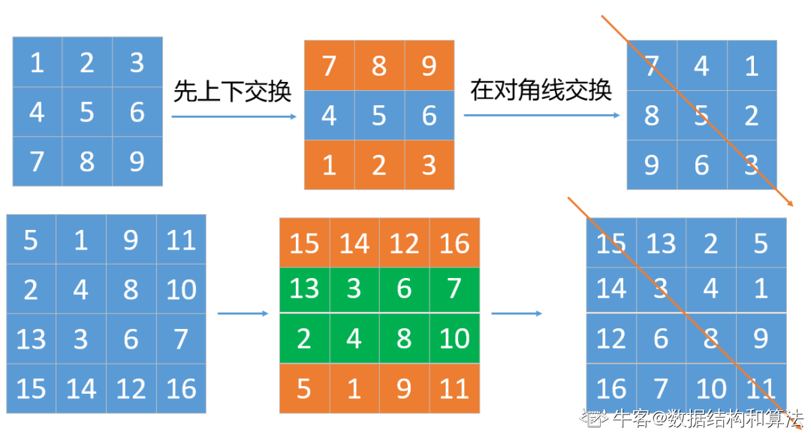

# 模拟

## 97. 旋转数组

三次翻转：

假设 n=6且 k=2

原始数组: `1 2 3 4 5 6` 
1. 反转所有数字后      :  `6 5 4 3 2 1`
2. 反转前 k 个数字后   :  `5 6  4 3 2 1`
3. 反转后 n-k 个数字后 :  `5 6  1 2 3 4`

```
import java.util.*;


public class Solution {
    /**
     * 旋转数组
     * @param n int整型 数组长度
     * @param m int整型 右移距离
     * @param a int整型一维数组 给定数组
     * @return int整型一维数组
     */
    public int[] solve (int n, int m, int[] a) {
        // write code here
        //防止m超过n，做无效的移动
        m = m % n;
        if(m==0||n<=0) return a;
        for(int i=0;i<n/2;i++) swap(a, i, n-1-i);
        for(int i=0;i<m/2;i++) swap(a, i, m-1-i);
        for(int i=m;i<(m+n)/2;i++) swap(a, i, m+n-1-i);
        return a;
    }
    
    private void swap(int[] a, int i, int j){
        int tmp = a[i];
        a[i] = a[j];
        a[j] = tmp;
    }
}
```

## 98. 螺旋矩阵

```
import java.util.ArrayList;
public class Solution {
    public ArrayList<Integer> spiralOrder(int[][] matrix) {
        if(matrix.length == 0) return new ArrayList<>();
        //右、下，左，上
        int[][] direction = new int[][]{ {1,0},{0,1},{-1,0},{0,-1} };
        int row = matrix.length, column = matrix[0].length;
        boolean[][] isVisited = new boolean[row][column];//判断是否访问过
        int len = row * column;//要添加的总数
        int moveX = 0, moveY = -1, tmpX = -1, tmpY = -1;
        int directionIndex = 0;
        ArrayList<Integer> res = new ArrayList<>();
        for(int i = 0; i < len; i++){
            tmpX = moveX + direction[directionIndex][1];
            tmpY = moveY + direction[directionIndex][0];
            if(tmpX < 0 || tmpX >= row
                    || tmpY < 0 || tmpY >= column
                    || isVisited[tmpX][tmpY]){
                //改变方向
                directionIndex++;
                directionIndex %= direction.length;
                tmpX = moveX + direction[directionIndex][1];
                tmpY = moveY + direction[directionIndex][0];
            }
            moveX = tmpX;
            moveY = tmpY;
            res.add(matrix[moveX][moveY]);
            isVisited[moveX][moveY] = true;
        }
        return res;
    }
}
```

## 99. 顺时针旋转矩阵



```
import java.util.*;

public class Solution {
    public int[][] rotateMatrix(int[][] matrix, int n) {
        // write code here
        int length = matrix.length;
        //先上下交换
        for (int i = 0; i < length / 2; i++) {
            int temp[] = matrix[i];
            matrix[i] = matrix[length - i - 1];
            matrix[length - i - 1] = temp;
        }
        //在按照对角线交换
        for (int i = 0; i < length; ++i) {
            for (int j = i + 1; j < length; ++j) {
                int temp = matrix[i][j];
                matrix[i][j] = matrix[j][i];
                matrix[j][i] = temp;
            }
        }
        return matrix;
    }
}
```

## 100. 设计LRU缓存结构

```
import java.util.*;


public class Solution {
    
    private int cap;
    private LinkedHashMap<Integer, Integer> linkedHashMap = new LinkedHashMap<>();
    
    public Solution(int capacity) {
         // write code here
        this.cap = capacity;
    }

    public int get(int key) {
         // write code here
        if (!linkedHashMap.containsKey(key)) {
            return -1;
        }
        // 将 key 变为最近使用  
        makeRecently(key);
        return linkedHashMap.get(key);
    }

    public void set(int key, int val) {
         // write code here
        if (linkedHashMap.containsKey(key)) {
            // 修改 key 的值，插入的是双向链表的尾部  
            linkedHashMap.put(key, val);
            // 将 key 变为最近使用  
            makeRecently(key);
            return;
        }
        if (linkedHashMap.size() >= this.cap) {
            // 链表头部就是最久未使用的 key  
            int oldestKey = linkedHashMap.keySet().iterator().next();
            linkedHashMap.remove(oldestKey);
        }
        // 将新的 key 添加链表尾部  
        linkedHashMap.put(key, val);
    }
    
    private void makeRecently(int key) {
        int val = linkedHashMap.get(key);
        // 删除 key，重新插入到队尾  
        linkedHashMap.remove(key);
        linkedHashMap.put(key, val);
    }
}

/**
 * Your Solution object will be instantiated and called as such:
 * Solution solution = new Solution(capacity);
 * int output = solution.get(key);
 * solution.set(key,value);
 */
```

## 101. 设计LFU缓存结构

```
import java.util.*;


public class Solution {
    /**
     * lfu design
     * @param operators int整型二维数组 ops
     * @param k int整型 the k
     * @return int整型一维数组
     */
    
    // key 到 val 的映射，我们后文称为 KV 表  
    private HashMap<Integer, Integer> keyToVal;
    // key 到 freq 的映射，我们后文称为 KF 表  
    private HashMap<Integer, Integer> keyToFreq;
    // freq 到 key 列表的映射，我们后文称为 FK 表，freq对key是一对多的关系  
    private HashMap<Integer, LinkedHashSet<Integer>> freqToKeys;
    // 记录最小的频次，避免遍历一遍去找  
    private int minFreq;
    // 记录 LFU 缓存的最大容量  
    private int cap;
    
    public int[] LFU (int[][] operators, int k) {
        // write code here
        keyToVal = new HashMap<>();
        keyToFreq = new HashMap<>();
        freqToKeys = new HashMap<>();
        this.cap = k;
        this.minFreq = 0;
        ArrayList<Integer> res = new ArrayList<>();
        for(int[] op : operators){
            if(op[0] == 1){
                put(op[1],op[2]);
            }else{
                res.add(get(op[1]));
            }
        }
        //利用流转int[]
        return res.stream().mapToInt(Integer::valueOf).toArray();
    }
    
    public int get(int key) {
        if (!keyToVal.containsKey(key)) {
            return -1;
        }
        // 增加 key 对应的 freq  
        increaseFreq(key);
        return keyToVal.get(key);
    }
    public void put(int key, int val) {
        if (this.cap <= 0) return;
        /* 若 key 已存在，修改对应的 val 即可 */
        if (keyToVal.containsKey(key)) {
            keyToVal.put(key, val);
            // key 对应的 freq 加一  
            increaseFreq(key);
            return;
        }
        /* key 不存在，需要插入 */
        /* 容量已满的话需要淘汰一个 freq 最小的 key */
        if (this.cap <= keyToVal.size()) {
            removeMinFreqKey();
        }
        /* 插入 key 和 val，对应的 freq 为 1 */
        // 插入 KV 表  
        keyToVal.put(key, val);
        // 插入 KF 表  
        keyToFreq.put(key, 1);
        // 插入 FK 表  
        freqToKeys.putIfAbsent(1, new LinkedHashSet<>());
        freqToKeys.get(1).add(key);
        // 插入新 key 后最小的 freq 肯定是 1  
        this.minFreq = 1;
    }
    private void increaseFreq(int key) {
        int freq = keyToFreq.get(key);
        /* 更新 KF 表 */
        keyToFreq.put(key, freq + 1);
        /* 更新 FK 表 */
        // 将 key 从 freq 对应的列表中删除  
        freqToKeys.get(freq).remove(key);
        // 将 key 加入 freq + 1 对应的列表中  
        freqToKeys.putIfAbsent(freq + 1, new LinkedHashSet<>());
        freqToKeys.get(freq + 1).add(key);
        // 如果 freq 对应的列表空了，移除这个 freq  
        if (freqToKeys.get(freq).isEmpty()) {
            freqToKeys.remove(freq);
            // 如果这个 freq 恰好是 minFreq，更新 minFreq  
            if (freq == this.minFreq) {
                this.minFreq++;
            }
        }
    }
    private void removeMinFreqKey() {
        // freq 最小的 key 列表  
        LinkedHashSet<Integer> keyList = freqToKeys.get(this.minFreq);
        // 其中最先被插入的那个 key 即最旧的key，就是该被淘汰的 key  
        int deletedKey = keyList.iterator().next();
        /* 更新 FK 表 */
        keyList.remove(deletedKey);
        if (keyList.isEmpty()) {
            freqToKeys.remove(this.minFreq);
            // 问：这里需要更新 minFreq 的值吗？
        }
        /* 更新 KV 表 */
        keyToVal.remove(deletedKey);
        /* 更新 KF 表 */
        keyToFreq.remove(deletedKey);
    }
}
```