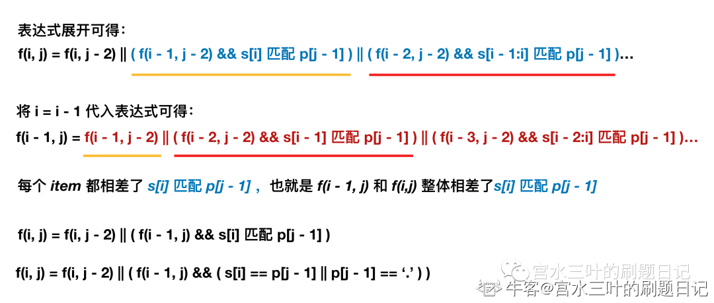

# 动态规划

## 62. 斐波那契数列

```
public class Solution {
    public int Fibonacci(int n) {
        if(n < 3) return 1;
        int[] dp = new int[n+1];
        dp[1] = 1;
        dp[2] = 1;
        for(int i = 3; i < n+1; i++){
            dp[i] = dp[i-1] + dp[i-2];
        }
        return dp[n];
    }
}
```

## 63. 跳台阶

```
public class Solution {
    public int jumpFloor(int target) {
        if(target == 1) return 1;
        if(target == 2) return 2;
        
        return jumpFloor(target-1) + jumpFloor(target-2);
    }
}
```

## 64. 最小花费爬楼梯

```
import java.util.*;


public class Solution {
    /**
     * 代码中的类名、方法名、参数名已经指定，请勿修改，直接返回方法规定的值即可
     *
     * 
     * @param cost int整型一维数组 
     * @return int整型
     */
    //dp[i]: 第i个台阶之前花了的最小费用
    public int minCostClimbingStairs (int[] cost) {
        // write code here
        int len = cost.length;
        int[] dp = new int[len+1];
        dp[0] = 0;
        dp[1] = 0;
        for(int i = 2; i < len+1; i++){
            dp[i] = Math.min(dp[i-1]+cost[i-1], dp[i-2] + cost[i-2]);
        }
        return dp[len];
    }
}
```

## 65. 最长公共子序列(二)

```
import java.util.*;


public class Solution {
    /**
     * longest common subsequence
     * @param s1 string字符串 the string
     * @param s2 string字符串 the string
     * @return string字符串
     */
    //在子数组arr1[0..i]和子数组arr2[0..j]中，我们要求的子序列（最长公共子序列）为dp[i][j]。
    public String LCS (String s1, String s2) {
        // write code here
        int n1=s1.length(),n2=s2.length();
        String[][] dp=new String[s1.length()+1][s2.length()+1];
        for (int i=0; i <= n1; i++){
            for (int j=0; j <= n2; j++){
                if(i==0||j==0) dp[i][j]=""; 
                else if(s1.charAt(i-1)==s2.charAt(j-1)){
                    dp[i][j]=dp[i-1][j-1]+s1.charAt(i-1);
                } else{
                    dp[i][j]=dp[i-1][j].length()>dp[i][j-1].length()
                        ?dp[i-1][j]
                        :dp[i][j-1];
                }
            }
        }
        return dp[n1][n2]==""?"-1":dp[n1][n2];
    }
}
```

## 66. 最长公共子串

```
import java.util.*;


public class Solution {
    /**
     * longest common substring
     * @param str1 string字符串 the string
     * @param str2 string字符串 the string
     * @return string字符串
     */
    // dp[i][j] 表示以str1[i]结尾，str2[j]结尾的最长公共子串
    public String LCS (String str1, String str2) {
        // write code here
        if (str1.length() == 0|| str2.length() == 0 || str1 == null || str2 == null) {
            return "";
        }
        int str1len = str1.length();
        int str2len = str2.length();
        int[][] dp = new int[str1len + 1][str2len + 1];
        //定位最长连续子串最后一个字符对应的索引
        int end = 0;
        //记录最长公共子串的长度
        int sum = 0;
        for (int i = 1; i <= str1len; i++) {
            for (int j = 1; j <= str2len; j++) {
                if(str1.charAt(i-1) == str2.charAt(j-1)){
                    dp[i][j] = dp[i-1][j-1] + 1;
                    if (sum < dp[i][j]){
                        sum = dp[i][j];
                        end = i - 1;
                    }
                }
            }
        }
        //对答案进行截取
        String res = str1.substring(end + 1 - sum,end + 1);
        return res;
    }
}
```

## 67. 不同路径的数目(一)

```
import java.util.*;


public class Solution {
    /**
     * 
     * @param m int整型 
     * @param n int整型 
     * @return int整型
     */
    public int uniquePaths (int m, int n) {
        // write code here
        if(m==1 || n==1){
            return 1;
        }
        return uniquePaths(m-1,n)+uniquePaths(m,n-1);
    }
}
```

## 68. 矩阵的最小路径和

```
import java.util.*;


public class Solution {
    /**
     * 
     * @param matrix int整型二维数组 the matrix
     * @return int整型
     */
    public int minPathSum (int[][] matrix) {
        // write code here
        int m = matrix.length;
        int n = matrix[0].length;
        int[][] dp = new int[m][n];
        dp[0][0] = matrix[0][0];
        for (int i=1;i<n;++i) dp[0][i] = dp[0][i-1] + matrix[0][i];
        for (int i=1;i<m;++i) dp[i][0] = dp[i-1][0] + matrix[i][0];
        for (int i=1;i<m;++i){
            for(int j=1;j<n;++j){
                dp[i][j] = Math.min(dp[i-1][j],dp[i][j-1]) + matrix[i][j];
            }
        }
        return dp[m-1][n-1];
    }
}
```

## 69. 把数字翻译成字符串

```
import java.util.*;


public class Solution {
    /**
     * 解码
     * @param nums string字符串 数字串
     * @return int整型
     */
    public int solve (String nums) {
        // write code here
        // 带条件的青蛙跳台阶
        // 如果n位数和n-1位的数字组合而成的2位数在10-26闭区间中，f(n)=f(n-1)+f(n-2);
        // 否则f(n)=f(n-1)
        // 注意，有几个题干没说清楚的点在此补充：
        // 0+个位数不能当个位数来使，比如1102只能拆成1/10/2不能拆成11/02
        // 不能出现孤立0在末位的情况，比如100不能当成10/0处理，但010可以当成0/10处理
        // 字符串“0”算作0种译法
        if(nums.length()==0 || "0".equals(nums)){
            return 0;
        }
        int a = 1;
        int b = 1;
        int sum = 1;
        for(int i=1;i<nums.length();i++){
            // 计算和前一个数组成2位数的值
            int value = Integer.parseInt(""+nums.charAt(i-1)+nums.charAt(i));
            // 很重要的一步操作
            if(nums.charAt(i) == '0')
                b = 0;
            // 带条件的青蛙跳台阶
            if(value>=10 && value <=26){
                sum = a + b;
            }
            else{
                sum = b;
            }
            a = b;
            b = sum;
        }
        return sum;
    }
}
```

## 70. 兑换零钱(一)

```
import java.util.*;


public class Solution {
    /**
     * 最少货币数
     * @param arr int整型一维数组 the array
     * @param aim int整型 the target
     * @return int整型
     */
    public int minMoney (int[] arr, int aim) {
        // write code here
        int[] dp = new int[aim + 1]; // 记录状态数组
        Arrays.fill(dp, aim + 1);
        dp[0] = 0; // 初始条件
        for (int i = 1; i <= aim; i++) {
           for (int j = 0; j < arr.length; j++) {
                if (i-arr[j] >= 0) // 边界条件判断
                    dp[i] = Math.min(dp[i], dp[i - arr[j]] + 1);
            }
        }
        return dp[aim]==aim + 1 ? -1 : dp[aim];
    }
}
```

## 71. 最长上升子序列(一)

```
import java.util.*;


public class Solution {
    /**
     * 代码中的类名、方法名、参数名已经指定，请勿修改，直接返回方法规定的值即可
     *
     * 给定数组的最长严格上升子序列的长度。
     * @param arr int整型一维数组 给定的数组
     * @return int整型
     */
    // dp[i]表示以arr[i]结尾时的最长递增子序列长度
    public int LIS (int[] arr) {
        // write code here
        int n = arr.length;
        if(n == 0) return 0;
        int[] dp = new int[n];
        Arrays.fill(dp, 1);
        int maxLen = 1;
        for(int i = 1; i < n; i++){
            //找到该轮中以i结尾最长的子序列
            for(int j = i - 1; j >= 0; j--){
                if(arr[j] < arr[i]){
                    // arr[j] < arr[i]，可以把arr[i]接在arr[j]后面，构成长度为dp[j]+1的递增子序列
                    dp[i] = Math.max(dp[i], dp[j] + 1);     // 选择能构成更长递增子序列的arr[j]
                }
            }
            maxLen = Math.max(maxLen, dp[i]);
        }
        return maxLen;
    }
}
```

## 72. 连续子数组的最大和

```
import java.util.*;
public class Solution {
    //dp[i]表示以i结尾的连续子数组的最大和。
    public int FindGreatestSumOfSubArray(int[] array) {
        int len = array.length;
        int[] dp = new int[len+1];
        Arrays.fill(dp,1);
        dp[0] = 0; // 表示没有元素
        int ret = array[0];
        for (int i=1; i<=len; ++i) {
            dp[i] = Math.max(array[i-1], dp[i-1]+array[i-1]);
            ret = Math.max(ret, dp[i]);
        }
        return ret;
    }
}
```

## 73. 最长回文子串

非动态规划

```
import java.util.*;


public class Solution {
    /**
     * 代码中的类名、方法名、参数名已经指定，请勿修改，直接返回方法规定的值即可
     *
     * 
     * @param A string字符串 
     * @return int整型
     */
    public int getLongestPalindrome (String A) {
        // write code here
        int maxLen = Integer.MIN_VALUE;
        int len = A.length();
        for (int i = 0; i < len; i++) {
            // 这里一定要注意奇数长度和偶数长度的回文串都要考虑
            maxLen=Math.max(maxLen,palindrome(i-1,i+1,A));
            maxLen=Math.max(maxLen,palindrome(i,i+1,A));
        }
        return maxLen;
    }
    
    // 获取指定 l r 开始的最长的回文串长度
    private int palindrome(int l,int r,String A) {
        while (l>=0 && r<=A.length()-1 && A.charAt(l)==A.charAt(r)) {
            l--;
            r++;
        }
        return r-l-1;
    }
}
```

## 74. 数字字符串转化成IP地址

回溯

```
import java.util.*;


public class Solution {
    /**
     * 
     * @param s string字符串 
     * @return string字符串ArrayList
     */
    ArrayList<String> res = new ArrayList<>();
    public ArrayList<String> restoreIpAddresses (String s) {
        // write code here
        ArrayList<String> path = new ArrayList<>();
        backtrack(s, 0, path);
        return res;
    }
    public void backtrack(String str, int startIdx, List<String> path) {
        //条件满足
        if(path.size() == 4) {
            String a = path.get(0);
            String b = path.get(1);
            String c = path.get(2);
            String d = path.get(3);
            if(a.length() + b.length() + c.length() + d.length() == str.length()) {
                res.add(a + "." + b + "." + c + "." + d);
            }
            return;
        }
        //只能一次性取1~3位，且取完后的索引不能超过字符串的长度
        for(int i = startIdx; i < str.length() && i < startIdx + 3; i++) {
            String subStr = "";
            subStr = str.substring(startIdx, i + 1);
            Integer subNum = Integer.parseInt(subStr);
            //只有当数字在0到255之间的数才继续递归
            if(subNum >= 0 && subNum <= 255) {
                path.add(subNum.toString());
                backtrack(str, i + 1, path);
                path.remove(path.size() - 1);
            }
        }
    }
}
```

## 75. 编辑距离(一)

```
import java.util.*;


public class Solution {
    /**
     * 代码中的类名、方法名、参数名已经指定，请勿修改，直接返回方法规定的值即可
     *
     * 
     * @param str1 string字符串 
     * @param str2 string字符串 
     * @return int整型
     */
    //dp[i-1][j-1] # 存储 s1[0..i] 和 s2[0..j] 的最小编辑距离
    public int editDistance (String s1, String s2) {
        // write code here
        int m = s1.length(), n = s2.length();  
        int[][] dp = new int[m + 1][n + 1];  
        // base case  
        for(int i = 1; i <= m; i++) dp[i][0] = i; //删除s1的i个字符  
        for(int j = 1; j <= n; j++) dp[0][j] = j; //往s1插入j个字符  
        for(int i = 1; i <= m; i++)  
            for(int j = 1; j <= n; j++)  
                if(s1.charAt(i - 1) == s2.charAt(j - 1)) dp[i][j] = dp[i - 1][j - 1];//相等，不做操作  
                else dp[i][j] = Math.min( Math.min(  
                        dp[i - 1][j] + 1, //删除s1中i对应的字符  
                        dp[i][j - 1] + 1), //往s1插入s2中j对应的字符  
                        dp[i - 1][j - 1] + 1//把s1中i的字符替换为s2中j对应的字符  
                        );  
        //存的整个s1到s2的最小修改距离  
        return dp[m][n];  
    }
}
```

## 76. 正则表达式匹配

为了方便，使用 `ss` 代指 `str`，使用 `pp` 代指 `pattern`。

整理一下题意，对于字符串 `p` 而言，有三种字符：

* 普通字符：需要和 `s` 中同一位置的字符完全匹配
* `'.'`：能够匹配 `s` 中同一位置的任意字符
* `'*'`：不能够单独使用 `'*'`，必须和前一个字符同时搭配使用，数据保证了 `'*'` 能够找到前面一个字符。能够匹配 `s` 中同一位置字符任意次。

所以本题关键是分析当出现 `a*` 这种字符时，是匹配 0 个 a、还是 1 个 a、还是 2 个 a ...

本题可以使用动态规划进行求解：

* 状态定义：`f(i,j)` 代表考虑 `s` 中以 `i` 为结尾的子串和 `p` 中的 `j` 为结尾的子串是否匹配。即最终我们要求的结果为 `f[n][m]` 。

* 状态转移：也就是我们要考虑 `f(i,j)` 如何求得，前面说到了 `p` 有三种字符，所以这里的状态转移也要分三种情况讨论：

   1. `p[j]` 为普通字符：匹配的条件是前面的字符匹配，同时 `s` 中的第 `i` 个字符和 `p` 中的第 `j` 位相同。 即 `f(i,j) = f(i - 1, j - 1) && s[i] == p[j]` 。

   2. `p[j]` 为 `'.'`：匹配的条件是前面的字符匹配， `s` 中的第 `i` 个字符可以是任意字符。即 f(i,j) = f(i - 1, j - 1) && p[j] == `'.'`。

   3. `p[j]` 为 `'*'`：读得 `p[j - 1]` 的字符，例如为字符 `a`。 然后根据 `a*` 实际匹配 `s` 中 `a` 的个数是 0 个、1 个、2 个 ...

        3.1. 当匹配为 0 个：`f(i,j) = f(i, j - 2)`

        3.2. 当匹配为 1 个：`f(i,j) = f(i - 1, j - 2) && (s[i] == p[j - 1] || p[j - 1] == '.')`

        3.3. 当匹配为 2 个：`f(i,j) = f(i - 2, j - 2) && ((s[i] == p[j - 1] && s[i - 1] == p[j - 1]) || p[j-1] == '.')`

        ...

我们知道，通过「枚举」来确定 `*` 到底匹配多少个 `a` 这样的做法，算法复杂度是很高的。

我们需要挖掘一些「性质」来简化这个过程。



```
import java.util.*;


public class Solution {
    /**
     * 代码中的类名、方法名、参数名已经指定，请勿修改，直接返回方法规定的值即可
     *
     * 
     * @param str string字符串 
     * @param pattern string字符串 
     * @return bool布尔型
     */
    public boolean match (String ss, String pp) {
        // write code here
        // 技巧：往原字符头部插入空格，这样得到 char 数组是从 1 开始，
        int n = ss.length(), m = pp.length();
        ss = " " + ss;
        pp = " " + pp;
        char[] s = ss.toCharArray();
        char[] p = pp.toCharArray();
        // f(i,j) 代表考虑 s 中的 1~i 字符和 p 中的 1~j 字符 是否匹配
        boolean[][] f = new boolean[n + 1][m + 1];
        // 而且可以使得 f[0][0] = true，可以将 true 这个结果滚动下去
        f[0][0] = true;
        for (int i = 0; i <= n; i++) {
            for (int j = 1; j <= m; j++) {
                // 如果下一个字符是 '*'，则代表当前字符不能被单独使用，跳过
                if (j + 1 <= m && p[j + 1] == '*') continue;
 
                // 对应了 p[j] 为普通字符和 '.' 的两种情况
                if (i - 1 >= 0 && p[j] != '*') {
                    f[i][j] = f[i - 1][j - 1] && (s[i] == p[j] || p[j] == '.');
                }
 
                // 对应了 p[j] 为 '*' 的情况
                else if (p[j] == '*') {
                    f[i][j] = (j - 2 >= 0 && f[i][j - 2]) || (i - 1 >= 0 && f[i - 1][j] && (s[i] == p[j - 1] || p[j - 1] == '.'));
                }
            }
        }
        return f[n][m];
    }
}
```

## 77. 最长的括号子串

我们定义 `dp[i]` 表示以下标 `i` 字符结尾的最长有效括号的长度。

我们将 dp 数组全部初始化为 0 。显然有效的子串一定以 `‘)’` 结尾，因此我们可以知道以 `‘(’` 结尾的子串对应的 dp 值必定为 0 ，我们只需要求解 `‘)’` 在 dp 数组中对应位置的值.

从前往后遍历字符串求解 dp 值，我们每两个字符检查一次:

1. `s[i] = ')'` 且 `s[i-1] = '('`，表示字符串形如 `‘......()’`，则可推出：
    ```
    dp[i] = dp[i-2] + 2
    ```
    以进行这样的转移，是因为结束部分的 "()" 是一个有效子字符串，并且将之前有效子字符串的长度增加了 2
2. `s[i] = ')'` 且 `s[i-1] = ')'`，表示字符串形如 `‘......))’`，则可推出：
    如果`s[i - dp[i-1] - 1] = '('`，则
    ```
    dp[i] = dp[i-1] + dp[i-dp[i-1]-2] + 2
    ```
    >考虑如果倒数第二个 `‘)’` 是一个有效子字符串的一部分（记作 subs），对于最后一个`‘)’` ，如果它是一个更长子字符串的一部分，那么它一定有一个对应的 `‘(’` ，且它的位置在倒数第二个 `‘)’` 所在的有效子字符串的前面（也就是 subs的前面）。因此，如果子字符串 subs 的前面恰好是 `‘(’` ，那么我们就用 2 加上 subs 的长度（`dp[i−1]`）去更新 dp[i]。同时，也会把有效子串 “(subs)” 之前的有效子串的长度也加上，也就是再加上 `dp[i−dp[i−1]−2]`。

最后的答案即为 dp 数组中的最大值

```
import java.util.*;


public class Solution {
    /**
     * 
     * @param s string字符串 
     * @return int整型
     */
    public int longestValidParentheses (String s) {
        // write code here
        int maxans = 0, len = s.length();
        int[] dp = new int[len];
        for (int i = 1; i < len; i++) {
            if (s.charAt(i) == ')') {
                if (s.charAt(i - 1) == '(') {
                    dp[i] = (i >= 2 ? dp[i - 2] : 0) + 2;
                } else if (i - dp[i - 1] > 0 && s.charAt(i - dp[i - 1] - 1) == '(') {
                    dp[i] = dp[i - 1] + 2 + ((i - dp[i - 1]) >= 2 ? dp[i - dp[i - 1] - 2] : 0);
                }
                maxans = Math.max(maxans, dp[i]);
            }
        }
        return maxans;
    }
}
```

## 78. 打家劫舍(一)

```
import java.util.*;


public class Solution {
    /**
     * 代码中的类名、方法名、参数名已经指定，请勿修改，直接返回方法规定的值即可
     *
     * 
     * @param nums int整型一维数组 
     * @return int整型
     */
    public int rob (int[] nums) {
        // write code here
        if(nums.length == 1){
            return nums[0];
        } else if(nums.length == 2){
            return Math.max(nums[0],nums[1]);
        }
        int[] dp = new int[nums.length];
        dp[0] = nums[0];
        dp[1] = Math.max(nums[0],nums[1]);
        for (int i = 2; i < nums.length; i++){
            dp[i] = Math.max(dp[i-1],dp[i-2]+nums[i]);
        }
        return dp[nums.length-1];
    }
}
```

## 79. 打家劫舍(二)

成环形

```
import java.util.*;


public class Solution {
    /**
     * 代码中的类名、方法名、参数名已经指定，请勿修改，直接返回方法规定的值即可
     *
     * 
     * @param nums int整型一维数组 
     * @return int整型
     */
    public int rob (int[] nums) {
        // write code here
        int n=nums.length;
        //在0到n-2范围内找
        int rob1=robNoCircle(Arrays.copyOfRange(nums,0,n-1));
        //在1到n-1范围内找
        int rob2=robNoCircle(Arrays.copyOfRange(nums,1,n));
         
        return Math.max(rob1,rob2);  
    }
    
    private int robNoCircle(int[] nums) {
        // write code here
        if(nums.length == 1){
            return nums[0];
        } else if(nums.length == 2){
            return Math.max(nums[0],nums[1]);
        }
        int[] dp = new int[nums.length];
        dp[0] = nums[0];
        dp[1] = Math.max(nums[0],nums[1]);
        for (int i = 2; i < nums.length; i++){
            dp[i] = Math.max(dp[i-1],dp[i-2]+nums[i]);
        }
        return dp[nums.length-1];
    }
}
```

## 80. 买卖股票的最好时机(一)

只能交易一次

```
import java.util.*;


public class Solution {
    /**
     * 
     * @param prices int整型一维数组 
     * @return int整型
     */
    public int maxProfit (int[] prices) {
        // write code here
        int len = prices.length;
        int[][] dp = new int[len][2];
        dp[0][1] = -prices[0];
        dp[0][0] = 0;
        for(int i = 1; i < len; i++){
            dp[i][0] = Math.max(dp[i-1][0],dp[i-1][1] + prices[i]);
            dp[i][1] = Math.max(dp[i-1][1], - prices[i]);
        }
        return dp[len-1][0];
    }
}
```

## 81. 买卖股票的最好时机(二)

不限制交易次数

```
import java.util.*;


public class Solution {
    /**
     * 代码中的类名、方法名、参数名已经指定，请勿修改，直接返回方法规定的值即可
     * 计算最大收益
     * @param prices int整型一维数组 股票每一天的价格
     * @return int整型
     */
    public int maxProfit (int[] prices) {
        // write code here
        int len = prices.length;
        int[][] dp = new int[len][2];
        dp[0][1] = -prices[0];
        dp[0][0] = 0;
        for(int i = 1; i < len; i++){
            dp[i][0] = Math.max(dp[i-1][0],dp[i-1][1] + prices[i]);
            dp[i][1] = Math.max(dp[i-1][1],dp[i-1][0] - prices[i]);
        }
        return dp[len-1][0];
    }
}
```

## 82. 买卖股票的最好时机(三)

只能交易2次

```
import java.util.*;


public class Solution {
    /**
     * 代码中的类名、方法名、参数名已经指定，请勿修改，直接返回方法规定的值即可
     * 两次交易所能获得的最大收益
     * @param prices int整型一维数组 股票每一天的价格
     * @return int整型
     */
    public int maxProfit (int[] prices) {
        // write code here
        int len = prices.length;
        int maxK = 2;//只能交易两次
        int[][][] dp = new int[len][maxK+1][2];
        
        for(int i = 0; i < len; i++){
            for (int k = maxK; k >= 1; k--){
                if (i - 1 == -1) {
                    dp[i][k][0] = 0;
                    dp[i][k][1] = - prices[i];
                    continue;
                }
                dp[i][k][0] = Math.max(dp[i-1][k][0],dp[i-1][k][1] + prices[i]);
                dp[i][k][1] = Math.max(dp[i-1][k][1],dp[i-1][k-1][0] - prices[i]);//买时算一次交易
            }
        }
        return dp[len-1][maxK][0];
    }
}
```