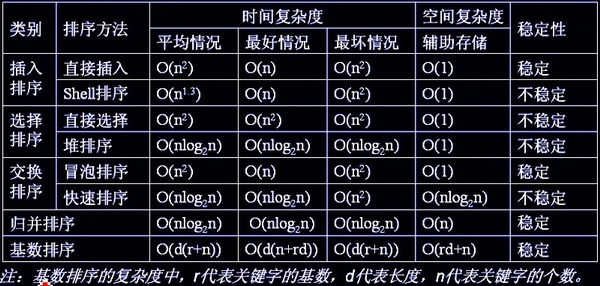

# 排序算法



## 1. 快速排序

先序遍历

```
public void quickSort(int[] nums,int begin,int end){
    if(nums == null || nums.length <= 0 || begin >= end){
        return;
    }
    int index = process(nums,begin,end);
    quickSort(nums,0,index-1);
    quickSort(nums,index+1,end);
}

private int process(int[] nums,int begin,int end){
    int key = nums[begin];
    while (begin < end){
        while(key <= nums[end] && begin < end){
            end--;
        }
        nums[begin] = nums[end];
        while(key >= nums[begin] && begin < end){
            begin++;
        }
        nums[end] = nums[begin];
    }
    nums[begin] = key;
    return begin;
}
```

## 2. 归并排序

后序遍历

```
public void mergeSort(int[] nums,int start,int end,int[] tempNums){
    if(nums == null || nums.length <= 0 || tempNums == null || tempNums.length < nums.length
            || start >= end){
        return;
    }
    int mid = (start + end) / 2;
    mergeSort(nums,start,mid,tempNums);
    mergeSort(nums,mid + 1,end,tempNums);
    mergeArray(nums,start,mid,end,tempNums);
}

private void mergeArray(int[] nums,int start,int mid,int end,int[] tempNums){
    if(nums == null || nums.length <= 0 || tempNums == null || tempNums.length < nums.length
            || start >= end){
        return;
    }

    int m = start,endM = mid;
    int n = mid + 1,endN = end;
    int tempPoint = 0;

    while (m <= endM && n <= endN){
        if(nums[m] < nums[n]){
            tempNums[tempPoint++] = nums[m++];
        }else {
            tempNums[tempPoint++] = nums[n++];
        }
    }

    while (m <= endM){
        tempNums[tempPoint++] = nums[m++];
    }

    while (n <= endN){
        tempNums[tempPoint++] = nums[n++];
    }

    for(int i = 0;i < tempPoint;i++){
        nums[start + i] = tempNums[i];
    }
}
```

## 3. 基尔排序

```
public void shellSort(int[] nums){
    if(nums == null || nums.length <= 0){
        return;
    }

    int numsLength = nums.length;
    int interval = 1;
    while(3 * interval + 1 <= numsLength){
        interval = 3 * interval + 1;
    }

    int temp,j;
    while (interval > 0){
        for(int i = interval;i < numsLength;i++){
            temp = nums[i];
            j = i;
            while(j > interval - 1 && nums[j - interval] > temp){
                nums[j] = nums[j - interval];
                j -= interval;
            }
            nums[j] = temp;
        }
        interval = (interval - 1)/3;
    }

}
```

## 4. 插入排序

```
public void insertSort(int[] nums){
    if(nums == null || nums.length == 0){
        return;
    }
    int temp,j,numsLength = nums.length;
    for(int i = 1;i < numsLength;i++){
        j = i;
        temp = nums[i];
        while(j > 0 && nums[j-1] >= temp){
            nums[j] = nums[--j];
        }
        nums[j] = temp;
    }
}
```

## 5. 冒泡排序

```
public void bubbleSort(int[] nums){
    if(nums == null || nums.length == 0){
        return;
    }

    int numsLength = nums.length;
    for(int i = 0;i < numsLength;i++){
        for(int j = 1;j < numsLength - i;j++){
            if(nums[j - 1] > nums[j]){
                nums[j] = nums[j] ^ nums[j - 1];
                nums[j - 1] = nums[j] ^ nums[j - 1];
                nums[j] = nums[j] ^ nums[j - 1];
            }
        }
    }
}
```

## 6. 选择排序

```
public void selectSort(int[] nums){
    if(nums == null || nums.length <= 0){
        return;
    }

    int minNum,temp,numsLength = nums.length;
    for(int i = 0;i < numsLength - 1; i++){
        minNum = i;
        for(int j = i + 1;j < numsLength; j++){
            if(nums[minNum] > nums[j]){
                minNum = j;
            }
        }
        if(minNum != i){
            temp = nums[minNum];
            nums[minNum] = nums[i];
            nums[i] = temp;
        }
    }
}
```