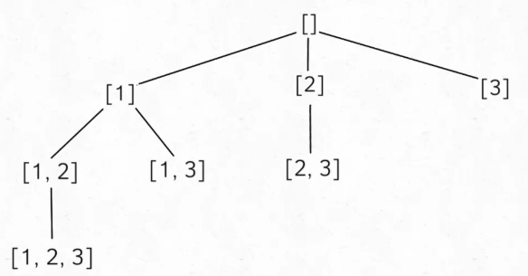

# 回溯

## **全排列**


```
// 路径：记录在 track 中  
// 选择列表：nums 中不存在于 track 的那些元素  
// 结束条件：nums 中的元素全都在 track 中出现  
void backtrack(int[] nums, LinkedList<Integer> track) {  
    // 触发结束条件  
    if (track.size() == nums.length) {  
	res.add(new LinkedList(track));  
	return;  
    }  
  
    for (int i = 0; i < nums.length; i++) {  
	// 排除不合法的选择  
	if (track.contains(nums[i]))  
	    continue;  
	// 做选择  
	track.add(nums[i]);  
	// 进入下一层决策树  
	backtrack(nums, track);  
	// 取消选择  
	track.removeLast();  
    }  
}  
```

## **组合：求子集**
①数学归纳：在之前的每一个子集中加入当前元素，然后添加到之前的子集的集合中。

②回溯



```
vector<vector<int>> res;  
  
vector<vector<int>> subsets(vector<int>& nums) {  
    // 记录走过的路径  
    vector<int> track;  
    backtrack(nums, 0, track);  
    return res;  
}  
  
void backtrack(vector<int>& nums, int start, vector<int>& track) {  
    res.push_back(track);  
    // 注意 i 从 start 开始递增  
    for (int i = start; i < nums.size(); i++) {  
	// 做选择  
	track.push_back(nums[i]);  
	// 回溯  
	backtrack(nums, i + 1, track);  
	// 撤销选择  
	track.pop_back();  
    }  
} 
```

## **N皇后**
给你一个 N×N 的棋盘，让你放置 N 个皇后，使得它们不能互相攻击。

PS：皇后可以攻击同一行、同一列、左上左下右上右下四个方向的任意单位。

```
// 路径：board 中小于 row 的那些行都已经成功放置了皇后  
// 选择列表：第 row 行的所有列都是放置皇后的选择  
// 结束条件：row 超过 board 的最后一行  
void backtrack(vector<string>& board, int row) {
    // 触发结束条件  
    if (row == board.size()) {
        res.push_back(board);
        return;
    }
    int n = board[row].size();
    for (int col = 0; col < n; col++) {
        // 排除不合法选择  
        if (!isValid(board, row, col))   
                continue;
        // 做选择  
        board[row][col] = 'Q';
        // 进入下一行决策  
        backtrack(board, row + 1);
        // 撤销选择  
        board[row][col] = '.';
    }
}
/* 是否可以在 board[row][col] 放置皇后？ */
bool isValid(vector<string>& board, int row, int col) {
    int n = board.size();
    // 检查列是否有皇后互相冲突  
    for (int i = 0; i < n; i++) {
        if (board[i][col] == 'Q')  
                return false;
    }
    // 检查右上方是否有皇后互相冲突  
    for (int i = row - 1, j = col + 1;   
            i >= 0 && j < n; i--, j++) {
        if (board[i][j] == 'Q')  
                return false;
    }
    // 检查左上方是否有皇后互相冲突  
    for (int i = row - 1, j = col - 1;  
            i >= 0 && j >= 0; i--, j--) {
        if (board[i][j] == 'Q')  
                return false;
    }
    return true;
}
```