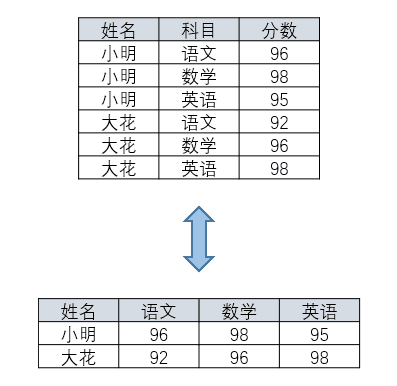

# leetcode SQL 入门

[leetcode SQL 入门](https://leetcode.cn/study-plan/sql/?progress=6ob4kpt)

## 一、选择

### 595. 大的国家

```
SELECT
    name, population, area
FROM
    world
WHERE
    area >= 3000000 OR population >= 25000000
;
```

### 1757. 可回收且低脂的产品

```
select product_id
from Products
where low_fats='Y'
and recyclable='Y'
```

### 584. 寻找用户推荐人

```
SELECT name FROM customer WHERE referee_id != 2 OR referee_id IS NULL;
```

想法

有的人也许会非常直观地想到如下解法。

Sql

`SELECT name FROM customer WHERE referee_Id <> 2;`

然而，这个查询只会返回一个结果：Zach，尽管事实上有 4 个顾客都不是 Jane 推荐的（包括 Jane 她自己）。所有没有推荐人（referee_id 字段值为 NULL) 的全部都消失了。

为什么?

MySQL 使用三值逻辑 —— TRUE, FALSE 和 UNKNOWN。任何与 NULL 值进行的比较都会与第三种值 UNKNOWN 做比较。这个“任何值”包括 NULL 本身！这就是为什么 MySQL 提供 IS NULL 和 IS NOT NULL 两种操作来对 NULL 特殊判断。

因此，在 WHERE 语句中我们需要做一个额外的条件判断 `referee_id IS NULL'。

### 183. 从不订购的客户

```
select customers.name as 'Customers'
from customers
where customers.id not in
(
    select customerid from orders
);
```

## 二、排序 & 修改

### 1873. 计算特殊奖金

写出一个SQL 查询语句，计算每个雇员的奖金。如果一个雇员的id是奇数并且他的名字不是以'M'开头，那么他的奖金是他工资的100%，否则奖金为0。

Return the result table ordered by employee_id.

```
输入：
Employees 表:
+-------------+---------+--------+
| employee_id | name    | salary |
+-------------+---------+--------+
| 2           | Meir    | 3000   |
| 3           | Michael | 3800   |
| 7           | Addilyn | 7400   |
| 8           | Juan    | 6100   |
| 9           | Kannon  | 7700   |
+-------------+---------+--------+
输出：
+-------------+-------+
| employee_id | bonus |
+-------------+-------+
| 2           | 0     |
| 3           | 0     |
| 7           | 7400  |
| 8           | 0     |
| 9           | 7700  |
+-------------+-------+
```

```
select employee_id,if(employee_id % 2 != 0 and left(name,1) != 'M',salary,0) as bonus
from Employees
order by employee_id
或
select 
    employee_id,
    case
        when employee_id % 2= 1 and left(name,1)!='M' then salary
        else 0
    end bonus
from Employees
```

>LEFT(str, length)：从左开始截取字符串，length 是截取的长度。

### 627. 变更性别

编写一个 SQL 查询来交换所有的 'f' 和 'm' （即，将所有 'f' 变为 'm' ，反之亦然），仅使用 单个 update 语句 ，且不产生中间临时表(不能 使用 select 语句)。

```
update salary set sex=IF(sex='f','m','f')
或
UPDATE salary
SET
    sex = CASE sex
        WHEN 'm' THEN 'f'
        ELSE 'm'
    END;
```

---

* case语句格式一

```
CASE input_expression
    WHEN expression1 THEN result_expression1
    WHEN expression2 THEN result_expression2
    [...n]
    ELSE result_expression
    END
```

CASE语句在执行时，将CASE后的表达式的值与各WHEN子句的表达式值比较，如果相等，则执行THEN后面的表达式或语句，然后跳出CASE语句；否则，返回ELSE后面的表达式。

* case语句格式二

```
CASE
    WHEN expression1 THEN result_expression1
    WHEN expression2 THEN result_expression2
    [...n]
    ELSE result_expression
    END
```

CASE后面没有表达式，多个WHEN子句中的表达式依次执行，如果表达式结果为真，则执行相应THEN关键字后面的表达式或语句，执行完毕之后跳出CASE语句。如果所有WHEN语句都为FALSE，则执行ELSE子句中的语句。

>小tips：在交换数据和列转行时可以考虑使用case语句

### 196. 删除重复的电子邮箱

```
delete from Person where id not in
(
    select id from 
    (
        select min(id) as id from Person group by Email 
    ) t
)
```

第二层嵌套是必需的，否则会报错：

```
You can't specify target table 'Person' for update in FROM clause
```

## 三、字符串处理函数/正则

### 1667. 修复表中的名字

编写一个 SQL 查询来修复名字，使得只有第一个字符是大写的，其余都是小写的。

函数|解释
:-|:-
CONCAT()|可以将多个字符串拼接在一起。
LEFT(str, length)|从左开始截取字符串，length 是截取的长度。
UPPER(str)|将字符串中所有字符转为大写
LOWER(str)|将字符串中所有字符转为小写
SUBSTRING(str, begin, end)|截取字符串，end 不写默认为空。**SUBSTRING(name, 2)**：从第二个截取到末尾，注意并不是下标，就是第二个。

```
SELECT user_id, CONCAT(UPPER(LEFT(name, 1)), LOWER(SUBSTRING(name, 2))) AS name
FROM Users
ORDER BY user_id
```

### 1484. 按日期分组销售产品

编写一个 SQL 查询来查找每个日期、销售的不同产品的数量及其名称。
每个日期的销售产品名称应按词典序排列。
返回按 sell_date 排序的结果表。

```
输入：
Activities 表：
+------------+-------------+
| sell_date  | product     |
+------------+-------------+
| 2020-05-30 | Headphone   |
| 2020-06-01 | Pencil      |
| 2020-06-02 | Mask        |
| 2020-05-30 | Basketball  |
| 2020-06-01 | Bible       |
| 2020-06-02 | Mask        |
| 2020-05-30 | T-Shirt     |
+------------+-------------+
输出：
+------------+----------+------------------------------+
| sell_date  | num_sold | products                     |
+------------+----------+------------------------------+
| 2020-05-30 | 3        | Basketball,Headphone,T-shirt |
| 2020-06-01 | 2        | Bible,Pencil                 |
| 2020-06-02 | 1        | Mask                         |
+------------+----------+------------------------------+
```

```
SELECT sell_date AS 'sell_date',
    COUNT(DISTINCT product) AS 'num_sold',
    GROUP_CONCAT(DISTINCT product 
        ORDER BY product ASC    #按照字典序排列，升序
        SEPARATOR ',')          #用','分隔
        AS 'products'    #组内拼接
FROM Activities
GROUP BY sell_date
ORDER BY sell_date;
```

### 1527. 患某种疾病的患者

[MySQL LIKE 子句 模糊匹配](https://blog.csdn.net/skyito88/article/details/124027362)

%：表示任意 0 个或多个字符。可匹配任意类型和长度的字符，有些情况下若是中文，请使用两个百分号（%%）表示。
_：表示任意单个字符。匹配单个任意字符，它常用来限制表达式的字符长度语句。

```
select patient_id, patient_name, conditions
from patients
where conditions like '% DIAB1%'
or conditions like 'DIAB1%'
```

## 四、组合查询 & 指定选取

### 1965. 丢失信息的雇员

写出一个查询语句，找到所有 丢失信息 的雇员id。当满足下面一个条件时，就被认为是雇员的信息丢失：

* 雇员的 姓名 丢失了，
* 或者雇员的 薪水信息 丢失了，

返回这些雇员的employee_id ， 从小到大排序 。

```
输入：
Employees table:
+-------------+----------+
| employee_id | name     |
+-------------+----------+
| 2           | Crew     |
| 4           | Haven    |
| 5           | Kristian |
+-------------+----------+
Salaries table:
+-------------+--------+
| employee_id | salary |
+-------------+--------+
| 5           | 76071  |
| 1           | 22517  |
| 4           | 63539  |
+-------------+--------+
输出：
+-------------+
| employee_id |
+-------------+
| 1           |
| 2           |
+-------------+
```

**解答1：**

传统外连接，[参考](https://qgao233.github.io/qgaoMajorKnowledge/chapter8/section6/)

```
SELECT
    temp.employee_id AS employee_id
FROM(   
    SELECT
        e.employee_id
        FROM
        employees e
        LEFT JOIN salaries s ON e.employee_id = s.employee_id
        WHERE
        s.salary IS NULL
    UNION
    SELECT
        s.employee_id
        FROM
        salaries s
        LEFT JOIN employees e ON s.employee_id = e.employee_id
        WHERE
        e.name IS NULL
    ) AS temp
ORDER BY temp.employee_id
```

**解答2：**

雇员的姓名丢失了或者雇员的薪水信息丢失，都会导致employee_id 在 employees 和salaries 的并集表里面仅出现一次

```
select 
    employee_id 
from 
    (
    select employee_id from employees
    union all 
    select employee_id from salaries
) as t
group by 
    employee_id
having 
    count(employee_id) = 1
order by 
    employee_id;
```

### 1795. 每个产品在不同商店的价格

**行列转换**



【行转列——MAX/SUM+CASE WHEN+GROUP BY】

```
SELECT name,
  MAX(CASE WHEN subject='语文' THEN score ELSE 0 END) AS "语文",
  MAX(CASE WHEN subject='数学' THEN score ELSE 0 END) AS "数学",
  MAX(CASE WHEN subject='英语' THEN score ELSE 0 END) AS "英语"
FROM student1
GROUP BY name
```

【列转行——MAX+UNION+GROUP BY】

```
SELECT NAME,'语文' AS subject,MAX("语文") AS score
FROM student2 GROUP BY NAME
UNION
SELECT NAME,'数学' AS subject,MAX("数学") AS score
FROM student2 GROUP BY NAME
UNION
SELECT NAME,'英语' AS subject,MAX("英语") AS score
FROM student2 GROUP BY NAME
```

**题目：**

```
输入：
Products table:
+------------+--------+--------+--------+
| product_id | store1 | store2 | store3 |
+------------+--------+--------+--------+
| 0          | 95     | 100    | 105    |
| 1          | 70     | null   | 80     |
+------------+--------+--------+--------+
输出：
+------------+--------+-------+
| product_id | store  | price |
+------------+--------+-------+
| 0          | store1 | 95    |
| 0          | store2 | 100   |
| 0          | store3 | 105   |
| 1          | store1 | 70    |
| 1          | store3 | 80    |
+------------+--------+-------+
```

**解答：**

```
select product_id,'store1' store,store1 price
from Products where store1 is not null
group by 1
union all
select product_id,'store2' store,store2 price
from Products where store2 is not null
group by 1
union all
select product_id,'store3' store,store3 price
from Products where store3 is not null
group by 1
```

>union 和 union all 的区别是，union 会自动压缩多个结果集合中的重复结果，而 union all 则将所有的结果全部显示出来，不管是不是重复。

### 608. 树节点

**题目：**

写一个查询语句，输出所有节点的编号和节点的类型，并将结果按照节点编号排序。

树中每个节点属于以下三种类型之一：

* 叶子：如果这个节点没有任何孩子节点。
* 根：如果这个节点是整棵树的根，即没有父节点。
* 内部节点：如果这个节点既不是叶子节点也不是根节点。

```
输入
+----+------+
| id | p_id |
+----+------+
| 1  | null |
| 2  | 1    |
| 3  | 1    |
| 4  | 2    |
| 5  | 2    |
+----+------+
输出
+----+------+
| id | Type |
+----+------+
| 1  | Root |
| 2  | Inner|
| 3  | Leaf |
| 4  | Leaf |
| 5  | Leaf |
+----+------+
```

**解答：**

[参考](https://qgao233.github.io/qgaoMajorKnowledge/chapter8/section6/)

```
# 根节点
SELECT A.id, 'Root' AS 'Type'
FROM tree AS A
WHERE A.p_id IS NULL

UNION

# 叶子节点
# 核心思想就是看：A中的id有没有当过父亲
# 为了排除只有一个节点的情况（根节点），加了 A.p_id IS NOT NULL
SELECT A.id, 'Leaf' AS 'Type'
FROM tree AS A LEFT JOIN tree AS B
  ON A.id = B.p_id
WHERE B.p_id IS NULL AND A.p_id IS NOT NULL

UNION

# 内部节点
SELECT A.id, 'Inner' AS 'Type'
FROM tree AS A LEFT JOIN tree AS B
  ON A.id = B.p_id
WHERE B.p_id IS NOT NULL AND A.p_id IS NOT NULL

ORDER BY id
;
```

### 176. 第二高的薪水

编写一个 SQL 查询，获取并返回 Employee 表中第二高的薪水 。如果不存在第二高的薪水，查询应该返回 null 。

```
示例 1：

输入：
Employee 表：
+----+--------+
| id | salary |
+----+--------+
| 1  | 100    |
| 2  | 200    |
| 3  | 300    |
+----+--------+
输出：
+---------------------+
| SecondHighestSalary |
+---------------------+
| 200                 |
+---------------------+

示例 2：

输入：
Employee 表：
+----+--------+
| id | salary |
+----+--------+
| 1  | 100    |
+----+--------+
输出：
+---------------------+
| SecondHighestSalary |
+---------------------+
| null                |
+---------------------+
```

```
因为本表可能只有一项记录。为了克服这个问题，我们可以将其作为临时表。
SELECT
    (SELECT DISTINCT
            Salary
        FROM
            Employee
        ORDER BY Salary DESC
        LIMIT 1 OFFSET 1) AS SecondHighestSalary
;

或
SELECT
    IFNULL(
      (SELECT DISTINCT Salary
       FROM Employee
       ORDER BY Salary DESC
        LIMIT 1 OFFSET 1),
    NULL) AS SecondHighestSalary

或mysql oracle通用
select max(Salary) SecondHighestSalary 
from Employee
where Salary < (select max(Salary) from Employee)
```

## 五、合并

### 175. 组合两个表

编写一个SQL查询来报告 Person 表中每个人的姓、名、城市和州。如果 personId 的地址不在 Address 表中，则报告为空  null 。

```
输入: 
Person表:
+----------+----------+-----------+
| personId | lastName | firstName |
+----------+----------+-----------+
| 1        | Wang     | Allen     |
| 2        | Alice    | Bob       |
+----------+----------+-----------+
Address表:
+-----------+----------+---------------+------------+
| addressId | personId | city          | state      |
+-----------+----------+---------------+------------+
| 1         | 2        | New York City | New York   |
| 2         | 3        | Leetcode      | California |
+-----------+----------+---------------+------------+
输出: 
+-----------+----------+---------------+----------+
| firstName | lastName | city          | state    |
+-----------+----------+---------------+----------+
| Allen     | Wang     | Null          | Null     |
| Bob       | Alice    | New York City | New York |
+-----------+----------+---------------+----------+
```

```
select FirstName, LastName, City, State
from Person left join Address
on Person.PersonId = Address.PersonId
```

### 1581. 进店却未进行过交易的顾客

有一些顾客可能光顾了购物中心但没有进行交易。请你编写一个 SQL 查询，来查找这些顾客的 ID ，以及他们只光顾不交易的次数。

返回以 任何顺序 排序的结果表。

```
输入:
Visits
+----------+-------------+
| visit_id | customer_id |
+----------+-------------+
| 1        | 23          |
| 2        | 9           |
| 4        | 30          |
| 5        | 54          |
| 6        | 96          |
| 7        | 54          |
| 8        | 54          |
+----------+-------------+
Transactions
+----------------+----------+--------+
| transaction_id | visit_id | amount |
+----------------+----------+--------+
| 2              | 5        | 310    |
| 3              | 5        | 300    |
| 9              | 5        | 200    |
| 12             | 1        | 910    |
| 13             | 2        | 970    |
+----------------+----------+--------+
输出:
+-------------+----------------+
| customer_id | count_no_trans |
+-------------+----------------+
| 54          | 2              |
| 30          | 1              |
| 96          | 1              |
+-------------+----------------+
```

```
SELECT 
    customer_id, COUNT(customer_id) count_no_trans
FROM 
    visits v
LEFT JOIN 
    transactions t ON v.visit_id = t.visit_id
WHERE amount IS NULL
GROUP BY customer_id;
```

### 1148. 文章浏览 I

编写一条 SQL 查询以找出所有浏览过自己文章的作者，结果按照 id 升序排列。

```
Views 表：
+------------+-----------+-----------+------------+
| article_id | author_id | viewer_id | view_date  |
+------------+-----------+-----------+------------+
| 1          | 3         | 5         | 2019-08-01 |
| 1          | 3         | 6         | 2019-08-02 |
| 2          | 7         | 7         | 2019-08-01 |
| 2          | 7         | 6         | 2019-08-02 |
| 4          | 7         | 1         | 2019-07-22 |
| 3          | 4         | 4         | 2019-07-21 |
| 3          | 4         | 4         | 2019-07-21 |
+------------+-----------+-----------+------------+

结果表：
+------+
| id   |
+------+
| 4    |
| 7    |
+------+
```

```
SELECT DISTINCT author_id AS id
FROM  Views
WHERE author_id = viewer_id
ORDER BY author_id
```

### 197. 上升的温度

编写一个 SQL 查询，来查找与之前（昨天的）日期相比温度更高的所有日期的 id 。

```
输入：
Weather 表：
+----+------------+-------------+
| id | recordDate | Temperature |
+----+------------+-------------+
| 1  | 2015-01-01 | 10          |
| 2  | 2015-01-02 | 25          |
| 3  | 2015-01-03 | 20          |
| 4  | 2015-01-04 | 30          |
+----+------------+-------------+
输出：
+----+
| id |
+----+
| 2  |
| 4  |
+----+
```

* datediff(日期1, 日期2)：
得到的结果是日期1与日期2相差的天数。
如果日期1比日期2大，结果为正；如果日期1比日期2小，结果为负。

```
SELECT
    weather.id AS 'Id'
FROM
    weather
       inner JOIN
    weather w ON DATEDIFF(weather.recordDate , w.recordDate ) = 1
        AND weather.Temperature > w.Temperature
```

### 607. 销售员

编写一个SQL查询，报告没有任何与名为 “RED” 的公司相关的订单的所有销售人员的姓名。

```
输入：
SalesPerson 表:
+----------+------+--------+-----------------+------------+
| sales_id | name | salary | commission_rate | hire_date  |
+----------+------+--------+-----------------+------------+
| 1        | John | 100000 | 6               | 4/1/2006   |
| 2        | Amy  | 12000  | 5               | 5/1/2010   |
| 3        | Mark | 65000  | 12              | 12/25/2008 |
| 4        | Pam  | 25000  | 25              | 1/1/2005   |
| 5        | Alex | 5000   | 10              | 2/3/2007   |
+----------+------+--------+-----------------+------------+
Company 表:
+--------+--------+----------+
| com_id | name   | city     |
+--------+--------+----------+
| 1      | RED    | Boston   |
| 2      | ORANGE | New York |
| 3      | YELLOW | Boston   |
| 4      | GREEN  | Austin   |
+--------+--------+----------+
Orders 表:
+----------+------------+--------+----------+--------+
| order_id | order_date | com_id | sales_id | amount |
+----------+------------+--------+----------+--------+
| 1        | 1/1/2014   | 3      | 4        | 10000  |
| 2        | 2/1/2014   | 4      | 5        | 5000   |
| 3        | 3/1/2014   | 1      | 1        | 50000  |
| 4        | 4/1/2014   | 1      | 4        | 25000  |
+----------+------------+--------+----------+--------+
输出：
+------+
| name |
+------+
| Amy  |
| Mark |
| Alex |
+------+
```

```
SELECT
    s.name
FROM
    salesperson s
WHERE
    s.sales_id NOT IN (SELECT
            o.sales_id
        FROM
            orders o
                LEFT JOIN
            company c ON o.com_id = c.com_id
        WHERE
            c.name = 'RED')
```

## 六、计算函数

### 1141. 查询近30天活跃用户数

请写SQL查询出截至 2019-07-27（包含2019-07-27），近 30 天的每日活跃用户数（当天只要有一条活动记录，即为活跃用户）。

```
输入：
Activity table:
+---------+------------+---------------+---------------+
| user_id | session_id | activity_date | activity_type |
+---------+------------+---------------+---------------+
| 1       | 1          | 2019-07-20    | open_session  |
| 1       | 1          | 2019-07-20    | scroll_down   |
| 1       | 1          | 2019-07-20    | end_session   |
| 2       | 4          | 2019-07-20    | open_session  |
| 2       | 4          | 2019-07-21    | send_message  |
| 2       | 4          | 2019-07-21    | end_session   |
| 3       | 2          | 2019-07-21    | open_session  |
| 3       | 2          | 2019-07-21    | send_message  |
| 3       | 2          | 2019-07-21    | end_session   |
| 4       | 3          | 2019-06-25    | open_session  |
| 4       | 3          | 2019-06-25    | end_session   |
+---------+------------+---------------+---------------+
输出：
+------------+--------------+ 
| day        | active_users |
+------------+--------------+ 
| 2019-07-20 | 2            |
| 2019-07-21 | 2            |
+------------+--------------+ 
```

datediff还要限制>=0不然会查询到07-27之后的数据。

```
select activity_date day, count(distinct user_id) active_users
from activity
where datediff('2019-07-27', activity_date) >= 0 AND datediff('2019-07-27', activity_date) <30
group by activity_date
```

### 1693. 每天的领导和合伙人

写一条 SQL 语句，使得对于每一个 date_id 和 make_name，返回不同的 lead_id 以及不同的 partner_id 的数量。

```
输入：
DailySales 表：
+-----------+-----------+---------+------------+
| date_id   | make_name | lead_id | partner_id |
+-----------+-----------+---------+------------+
| 2020-12-8 | toyota    | 0       | 1          |
| 2020-12-8 | toyota    | 1       | 0          |
| 2020-12-8 | toyota    | 1       | 2          |
| 2020-12-7 | toyota    | 0       | 2          |
| 2020-12-7 | toyota    | 0       | 1          |
| 2020-12-8 | honda     | 1       | 2          |
| 2020-12-8 | honda     | 2       | 1          |
| 2020-12-7 | honda     | 0       | 1          |
| 2020-12-7 | honda     | 1       | 2          |
| 2020-12-7 | honda     | 2       | 1          |
+-----------+-----------+---------+------------+
输出：
+-----------+-----------+--------------+-----------------+
| date_id   | make_name | unique_leads | unique_partners |
+-----------+-----------+--------------+-----------------+
| 2020-12-8 | toyota    | 2            | 3               |
| 2020-12-7 | toyota    | 1            | 2               |
| 2020-12-8 | honda     | 2            | 2               |
| 2020-12-7 | honda     | 3            | 2               |
+-----------+-----------+--------------+-----------------+
```

```
SELECT 
    date_id,
    make_name,
    COUNT(DISTINCT lead_id)  unique_leads,
    COUNT(DISTINCT partner_id) unique_partners
FROM 
    DailySales
GROUP BY 
    date_id, make_name;
```

### 1729. 求关注者的数量

写出 SQL 语句，对于每一个用户，返回该用户的关注者数量。

按 user_id 的顺序返回结果表。

```
输入：
Followers 表：
+---------+-------------+
| user_id | follower_id |
+---------+-------------+
| 0       | 1           |
| 1       | 0           |
| 2       | 0           |
| 2       | 1           |
+---------+-------------+
输出：
+---------+----------------+
| user_id | followers_count|
+---------+----------------+
| 0       | 1              |
| 1       | 1              |
| 2       | 2              |
+---------+----------------+
```

```
select 
    user_id, COUNT(*) followers_count
from 
    followers
 group by user_id
 order by user_id;
```

### 586. 订单最多的客户

编写一个SQL查询，为下了 最多订单 的客户查找 customer_number 。

>测试用例生成后， 恰好有一个客户 比任何其他客户下了更多的订单。

```
输入: 
Orders 表:
+--------------+-----------------+
| order_number | customer_number |
+--------------+-----------------+
| 1            | 1               |
| 2            | 2               |
| 3            | 3               |
| 4            | 3               |
+--------------+-----------------+
输出: 
+-----------------+
| customer_number |
+-----------------+
| 3               |
+-----------------+
```

```
SELECT
    customer_number
FROM
    orders
GROUP BY customer_number
ORDER BY COUNT(*) DESC
LIMIT 1
```

### 511. 游戏玩法分析 I

写一条 SQL 查询语句获取每位玩家 第一次登陆平台的日期。

```
Activity 表：
+-----------+-----------+------------+--------------+
| player_id | device_id | event_date | games_played |
+-----------+-----------+------------+--------------+
| 1         | 2         | 2016-03-01 | 5            |
| 1         | 2         | 2016-05-02 | 6            |
| 2         | 3         | 2017-06-25 | 1            |
| 3         | 1         | 2016-03-02 | 0            |
| 3         | 4         | 2018-07-03 | 5            |
+-----------+-----------+------------+--------------+

Result 表：
+-----------+-------------+
| player_id | first_login |
+-----------+-------------+
| 1         | 2016-03-01  |
| 2         | 2017-06-25  |
| 3         | 2016-03-02  |
+-----------+-------------+
```

```
select 
    player_id,
    min(event_date) first_login
from activity
group by player_id
```

### 1890. 2020年最后一次登录

编写一个 SQL 查询，该查询可以获取在 2020 年登录过的所有用户的本年度 最后一次 登录时间。结果集 不 包含 2020 年没有登录过的用户。

```
输入：
Logins 表:
+---------+---------------------+
| user_id | time_stamp          |
+---------+---------------------+
| 6       | 2020-06-30 15:06:07 |
| 6       | 2021-04-21 14:06:06 |
| 6       | 2019-03-07 00:18:15 |
| 8       | 2020-02-01 05:10:53 |
| 8       | 2020-12-30 00:46:50 |
| 2       | 2020-01-16 02:49:50 |
| 2       | 2019-08-25 07:59:08 |
| 14      | 2019-07-14 09:00:00 |
| 14      | 2021-01-06 11:59:59 |
+---------+---------------------+
输出：
+---------+---------------------+
| user_id | last_stamp          |
+---------+---------------------+
| 6       | 2020-06-30 15:06:07 |
| 8       | 2020-12-30 00:46:50 |
| 2       | 2020-01-16 02:49:50 |
+---------+---------------------+
```

```
SELECT 
    user_id, max(time_stamp) last_stamp
FROM 
    Logins
WHERE 
    year(time_stamp) = '2020'
GROUP BY 
    user_id;
或
select user_id, max(time_stamp) as last_stamp
from Logins
where time_stamp>='2020-01-01' and time_stamp<'2021-01-01'
group by user_id
```

### 1741. 查找每个员工花费的总时间

编写一个SQL查询以计算每位员工每天在办公室花费的总时间（以分钟为单位）。 请注意，在一天之内，同一员工是可以多次进入和离开办公室的。 在办公室里一次进出所花费的时间为out_time 减去 in_time。

```
Employees table:
+--------+------------+---------+----------+
| emp_id | event_day  | in_time | out_time |
+--------+------------+---------+----------+
| 1      | 2020-11-28 | 4       | 32       |
| 1      | 2020-11-28 | 55      | 200      |
| 1      | 2020-12-03 | 1       | 42       |
| 2      | 2020-11-28 | 3       | 33       |
| 2      | 2020-12-09 | 47      | 74       |
+--------+------------+---------+----------+
Result table:
+------------+--------+------------+
| day        | emp_id | total_time |
+------------+--------+------------+
| 2020-11-28 | 1      | 173        |
| 2020-11-28 | 2      | 30         |
| 2020-12-03 | 1      | 41         |
| 2020-12-09 | 2      | 27         |
+------------+--------+------------+
```

```
SELECT 
    event_day AS day,
    emp_id,
    sum(out_time-in_time) AS total_time 
FROM Employees
GROUP BY event_day,emp_id;
```

## 七、控制流

### 1393. 股票的资本损益

编写一个SQL查询来报告每支股票的资本损益。

股票的资本损益是一次或多次买卖股票后的全部收益或损失。

```
Stocks 表:
+---------------+-----------+---------------+--------+
| stock_name    | operation | operation_day | price  |
+---------------+-----------+---------------+--------+
| Leetcode      | Buy       | 1             | 1000   |
| Corona Masks  | Buy       | 2             | 10     |
| Leetcode      | Sell      | 5             | 9000   |
| Handbags      | Buy       | 17            | 30000  |
| Corona Masks  | Sell      | 3             | 1010   |
| Corona Masks  | Buy       | 4             | 1000   |
| Corona Masks  | Sell      | 5             | 500    |
| Corona Masks  | Buy       | 6             | 1000   |
| Handbags      | Sell      | 29            | 7000   |
| Corona Masks  | Sell      | 10            | 10000  |
+---------------+-----------+---------------+--------+

Result 表:
+---------------+-------------------+
| stock_name    | capital_gain_loss |
+---------------+-------------------+
| Corona Masks  | 9500              |
| Leetcode      | 8000              |
| Handbags      | -23000            |
+---------------+-------------------+
```

```
SELECT stock_name,
        SUM(
            CASE operation WHEN 'sell'   #如果我们的操作是卖出
            THEN price ELSE -price   #那么返回我们的到的收益，反之，操作是买入，返回支出
            END                  
           ) AS capital_gain_loss      #计算卖出和买入差值的和
FROM Stocks
GROUP BY stock_name  #要报告每只股票的资本损益，需要对股票进行分组
```

### 1407. 排名靠前的旅行者

写一段 SQL , 报告每个用户的旅行距离。

返回的结果表单，以 travelled_distance 降序排列 ，如果有两个或者更多的用户旅行了相同的距离, 那么再以 name 升序排列 。

```
Users 表：
+------+-----------+
| id   | name      |
+------+-----------+
| 1    | Alice     |
| 2    | Bob       |
| 3    | Alex      |
| 4    | Donald    |
| 7    | Lee       |
| 13   | Jonathan  |
| 19   | Elvis     |
+------+-----------+

Rides 表：
+------+----------+----------+
| id   | user_id  | distance |
+------+----------+----------+
| 1    | 1        | 120      |
| 2    | 2        | 317      |
| 3    | 3        | 222      |
| 4    | 7        | 100      |
| 5    | 13       | 312      |
| 6    | 19       | 50       |
| 7    | 7        | 120      |
| 8    | 19       | 400      |
| 9    | 7        | 230      |
+------+----------+----------+

Result 表：
+----------+--------------------+
| name     | travelled_distance |
+----------+--------------------+
| Elvis    | 450                |
| Lee      | 450                |
| Bob      | 317                |
| Jonathan | 312                |
| Alex     | 222                |
| Alice    | 120                |
| Donald   | 0                  |
+----------+--------------------+
```

```
select u.name,if(sum(distance) is null,0,sum(distance)) as travelled_distance 
from users u left join rides r on u.id = r.user_id
group by u.id
order by travelled_distance desc,u.name
```

### 1158. 市场分析 I

写出一条SQL语句以查询每个用户的注册日期和在 2019 年作为买家的订单总数。

```
输入：
Users 表:
+---------+------------+----------------+
| user_id | join_date  | favorite_brand |
+---------+------------+----------------+
| 1       | 2018-01-01 | Lenovo         |
| 2       | 2018-02-09 | Samsung        |
| 3       | 2018-01-19 | LG             |
| 4       | 2018-05-21 | HP             |
+---------+------------+----------------+
Orders 表:
+----------+------------+---------+----------+-----------+
| order_id | order_date | item_id | buyer_id | seller_id |
+----------+------------+---------+----------+-----------+
| 1        | 2019-08-01 | 4       | 1        | 2         |
| 2        | 2018-08-02 | 2       | 1        | 3         |
| 3        | 2019-08-03 | 3       | 2        | 3         |
| 4        | 2018-08-04 | 1       | 4        | 2         |
| 5        | 2018-08-04 | 1       | 3        | 4         |
| 6        | 2019-08-05 | 2       | 2        | 4         |
+----------+------------+---------+----------+-----------+
Items 表:
+---------+------------+
| item_id | item_brand |
+---------+------------+
| 1       | Samsung    |
| 2       | Lenovo     |
| 3       | LG         |
| 4       | HP         |
+---------+------------+
输出：
+-----------+------------+----------------+
| buyer_id  | join_date  | orders_in_2019 |
+-----------+------------+----------------+
| 1         | 2018-01-01 | 1              |
| 2         | 2018-02-09 | 2              |
| 3         | 2018-01-19 | 0              |
| 4         | 2018-05-21 | 0              |
+-----------+------------+----------------+
```

Items表是误导的。

```
select u.user_id as buyer_id, join_date ,ifnull(count(order_id),0) 
orders_in_2019 
from Users u left join Orders o on u.user_id=o. buyer_id and year(order_date)=2019
group by u.user_id;
```

### 182. 查找重复的电子邮箱

编写一个 SQL 查询，查找 Person 表中所有重复的电子邮箱。

```
输入
+----+---------+
| Id | Email   |
+----+---------+
| 1  | a@b.com |
| 2  | c@d.com |
| 3  | a@b.com |
+----+---------+
输出
+---------+
| Email   |
+---------+
| a@b.com |
+---------+
```

```
select Email
from Person
group by Email
having count(Email) > 1;
```

### 1050. 合作过至少三次的演员和导演

写一条SQL查询语句获取合作过至少三次的演员和导演的 id 对 (actor_id, director_id)

```
ActorDirector 表：
+-------------+-------------+-------------+
| actor_id    | director_id | timestamp   |
+-------------+-------------+-------------+
| 1           | 1           | 0           |
| 1           | 1           | 1           |
| 1           | 1           | 2           |
| 1           | 2           | 3           |
| 1           | 2           | 4           |
| 2           | 1           | 5           |
| 2           | 1           | 6           |
+-------------+-------------+-------------+

Result 表：
+-------------+-------------+
| actor_id    | director_id |
+-------------+-------------+
| 1           | 1           |
+-------------+-------------+
```

```
SELECT 
    actor_id, director_id
FROM 
    actordirector
GROUP BY actor_id, director_id
HAVING COUNT(*) >= 3;
```

### 1587. 银行账户概要 II

写一个 SQL,  报告余额高于 10000 的所有用户的名字和余额. 账户的余额等于包含该账户的所有交易的总和.

```
Users table:
+------------+--------------+
| account    | name         |
+------------+--------------+
| 900001     | Alice        |
| 900002     | Bob          |
| 900003     | Charlie      |
+------------+--------------+

Transactions table:
+------------+------------+------------+---------------+
| trans_id   | account    | amount     | transacted_on |
+------------+------------+------------+---------------+
| 1          | 900001     | 7000       |  2020-08-01   |
| 2          | 900001     | 7000       |  2020-09-01   |
| 3          | 900001     | -3000      |  2020-09-02   |
| 4          | 900002     | 1000       |  2020-09-12   |
| 5          | 900003     | 6000       |  2020-08-07   |
| 6          | 900003     | 6000       |  2020-09-07   |
| 7          | 900003     | -4000      |  2020-09-11   |
+------------+------------+------------+---------------+

Result table:
+------------+------------+
| name       | balance    |
+------------+------------+
| Alice      | 11000      |
+------------+------------+
```

```
select name,sum(Transactions.amount) as  balance from Users left join Transactions 
on Users.account=Transactions.account group by Users.account having balance>10000
```

### 1084. 销售分析III

编写一个SQL查询，报告2019年春季才售出的产品。即仅在2019-01-01至2019-03-31（含）之间卖出去的商品。

>如果一个产品不仅在范围内卖出，还在范围外也卖出，则不算。

```
输入：
Product table:
+------------+--------------+------------+
| product_id | product_name | unit_price |
+------------+--------------+------------+
| 1          | S8           | 1000       |
| 2          | G4           | 800        |
| 3          | iPhone       | 1400       |
+------------+--------------+------------+
Sales table:
+-----------+------------+----------+------------+----------+-------+
| seller_id | product_id | buyer_id | sale_date  | quantity | price |
+-----------+------------+----------+------------+----------+-------+
| 1         | 1          | 1        | 2019-01-21 | 2        | 2000  |
| 1         | 2          | 2        | 2019-02-17 | 1        | 800   |
| 2         | 2          | 3        | 2019-06-02 | 1        | 800   |
| 3         | 3          | 4        | 2019-05-13 | 2        | 2800  |
+-----------+------------+----------+------------+----------+-------+
输出：
+-------------+--------------+
| product_id  | product_name |
+-------------+--------------+
| 1           | S8           |
+-------------+--------------+
```

```
慢：
SELECT s.product_id, product_name
FROM Sales s
JOIN Product p
ON s.product_id = p.product_id
GROUP BY s.product_id
HAVING MIN(sale_date) >= '2019-01-01' AND MAX(sale_date) <= '2019-03-31'

快：
select product_id, product_name
from product
where product_id not in (
    select product_id
    from sales
    where sale_date >= '2019-04-01' or sale_date < '2019-01-01')
```